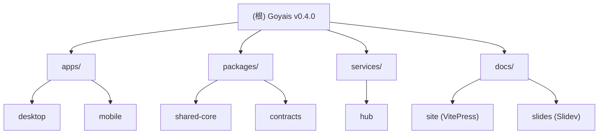

# Goyais — 根级架构文档

## 变更记录 (Changelog)

| 日期 | 版本 | 说明 |
|---|---|---|
| 2026-03-07 | 初始生成 | 由架构扫描脚本自动生成，覆盖率约 37% |

---

## 项目愿景

**Goyais** 是一套面向开发者的 AI 协作开发产品（v0.4.0，MIT 协议）。以会话驱动开发流程的 AI 开发工作台，围绕 `Workspace -> Project -> Session -> Run -> ChangeSet` 组织从需求输入、执行编排到变更交付的完整链路。

- 主入口：Desktop（Tauri + Vue 3 桌面客户端）
- 移动访问：Mobile（Tauri Mobile + Vue 3，仅远程工作区）
- 控制面：Hub（Go 后端服务，统一认证/执行/治理）

---

## 架构总览

```
Goyais Monorepo (pnpm + Turborepo)
├── apps/
│   ├── desktop/        # Tauri 桌面端，主产品入口
│   └── mobile/         # Tauri Mobile，远程工作区访问
├── packages/
│   ├── shared-core/    # 共享 TS 类型与 API 工具（发布为 @goyais/shared-core）
│   └── contracts/      # OpenAPI 规范（openapi.yaml，默认端口 8787）
├── services/
│   └── hub/            # Go 控制面服务（主二进制 + ACP sidecar + CLI）
├── docs/
│   ├── site/           # VitePress 文档站
│   ├── slides/         # Slidev 演示文稿
│   └── PRD.md          # 产品需求文档
├── scripts/            # 构建、质量检查、烟雾测试脚本
└── Makefile            # 快速开发命令入口
```

核心数据流：
1. Desktop/Mobile 通过 HTTP（本地 sidecar 或远程 Hub）调用 Hub REST API
2. Hub 提供 `/v1/auth`、`/v1/workspaces`、`/v1/sessions`、`/v1/runs` 等接口
3. Hub 内部 Agent Runtime（Go）执行 AI 模型调用，并通过 SSE 推送事件到客户端
4. `goyais-acp` sidecar 通过 stdio JSON-RPC（ACP 协议）与 Desktop Tauri shell 通信

---

## 模块结构图



---

## 模块索引

| 模块路径 | 包名 | 语言 | 一句话职责 |
|---|---|---|---|
| [apps/desktop](./apps/desktop/CLAUDE.md) | `@goyais/desktop` | TS + Vue 3 + Rust | Tauri 桌面端，本地/远程工作区主入口，会话执行与变更审阅 |
| [apps/mobile](./apps/mobile/CLAUDE.md) | `@goyais/mobile` | TS + Vue 3 + Rust | Tauri Mobile，远程工作区访问与轻量会话查看（iOS/Android） |
| [packages/shared-core](./packages/shared-core/CLAUDE.md) | `@goyais/shared-core` | TypeScript | 共享 API 类型定义与 OpenAPI 生成类型，供 desktop/mobile 消费 |
| [packages/contracts](./packages/contracts/CLAUDE.md) | contracts | YAML (OpenAPI 3.1) | Hub REST API 契约规范，驱动 shared-core 类型生成 |
| [services/hub](./services/hub/CLAUDE.md) | `goyais/services/hub` | Go 1.24 | 控制面服务：认证、工作区、Session/Run 执行、资源配置、管理审计 |

---

## 运行与开发

### 前置条件

- pnpm 10.11.0（`package.json` `packageManager` 字段锁定）
- Go 1.24+
- Rust（用于 Tauri 编译）
- Node.js LTS

### 快速启动（Makefile）

```bash
# 查看所有可用命令（含端口说明）
make dev

# 仅启动 Hub 后端（需要 HUB_INTERNAL_TOKEN 环境变量）
HUB_INTERNAL_TOKEN=xxx make dev-hub

# 启动 Desktop Web 预览（不含 Tauri shell）
make dev-web

# 完整 Desktop Tauri 开发模式（含 sidecar 构建）
make dev-desktop
```

### pnpm Turborepo 脚本

```bash
# 默认：启动 Desktop Vite dev server
pnpm dev

# Mobile Web 预览
pnpm dev:mobile

# 构建 Desktop
pnpm build

# 全量测试（Hub + Desktop）
make test

# Hub + Desktop 契约检查
pnpm contracts:check
```

### Hub 关键环境变量

| 环境变量 | 说明 | 默认值 |
|---|---|---|
| `PORT` | Hub 监听端口 | `8787` |
| `HUB_INTERNAL_TOKEN` | 内部令牌（开发必填） | 无 |

### Desktop / Mobile Vite 环境变量

| 变量 | 说明 |
|---|---|
| `VITE_RUNTIME_TARGET` | `desktop` / `mobile` / `web` |
| `VITE_HUB_BASE_URL` | Hub 地址（desktop 默认 `http://127.0.0.1:8787`） |
| `VITE_REQUIRE_HTTPS_HUB` | 强制 HTTPS（mobile 生产构建自动开启） |
| `VITE_ALLOW_INSECURE_HUB` | 允许 HTTP Hub（开发调试用） |

---

## 测试策略

| 层级 | 工具 | 命令 |
|---|---|---|
| Desktop 单元/集成 | Vitest 3 + jsdom + @vue/test-utils | `pnpm test` / `make test-desktop` |
| Hub 单元/集成 | Go testing (`go test ./...`) | `make test-hub` |
| E2E Smoke | Playwright | `pnpm e2e:smoke` |
| 覆盖率门禁 | Vitest coverage-v8 + 自定义阈值脚本 | `pnpm coverage:gate` |
| 质量门禁 | 文件大小 + 圈复杂度检查 | `pnpm quality:gate` |
| CSS Token 漂移 | 自定义脚本 | `pnpm check:tokens` |
| 契约同步检查 | openapi-typescript `--check` | `pnpm contracts:check` |
| 端到端健康检查 | Shell smoke 脚本 | `make health` |

---

## 编码规范

- **TypeScript**：严格模式，`tsc --noEmit` 作为 lint。避免 `any` 冒泡到 store 层
- **Vue 3**：Composition API + `<script setup>` 优先；Pinia store 按功能模块组织（`session/store`、`workspace/store` 等）
- **Go**：`go vet ./...` 检查；包按 Clean Architecture 分层（`core` 纯接口 -> `adapters` 实现 -> `runtime` 编排 -> `httpapi` 路由）；`core` 包不得有除标准库外的任何依赖
- **API 契约优先**：先改 `packages/contracts/openapi.yaml`，再跑 `pnpm contracts:generate` 生成 TS 类型，最后实现
- **Token 设计系统**：CSS 设计 token 通过 `check:tokens` 防止漂移，不直接写 hex/rgb 颜色值

---

## AI 使用指引

- `services/hub/internal/agent/core/interfaces.go` 是 Agent v4 架构的不可变锚点，修改需显式版本升级
- `packages/contracts/openapi.yaml` 是唯一真相来源，所有对象字段/状态枚举以此为准
- Desktop 前端功能修改需同时考虑 `desktop` 与 `mobile` 运行时目标分支（`isRuntimeCapabilitySupported()`）
- Hub 分层依赖方向：`httpapi` -> `internal/agent/*` -> `core`，禁止反向依赖
- ACP sidecar（`goyais-acp`）通过 stdio JSON-RPC 与 Tauri shell 通信，不直接暴露 HTTP

---

## 核心对象模型速查

```
Workspace (mode=local/remote, hub_url, auth_mode)
  └── Project (repo_path, is_git, 模型配置, Token 阈值)
        └── Session (queue_state: idle/running/queued, rule_ids, skill_ids, mcp_ids)
              └── Run (state: queued→pending→executing→confirming→awaiting_input→completed/failed/cancelled)
                    └── ChangeSet (entries, capability, suggested_message, project_kind=git/non_git)

ResourceConfig     (type=model/rule/skill/mcp, 工作区级)
ProjectConfig      (项目级资源绑定与阈值)
WorkspaceAgentConfig (Agent 默认行为: 轮次/Trace/预算/MCP)
PermissionSnapshot (角色 + 权限集合 + 菜单可见性 + 动作可见性)
```
