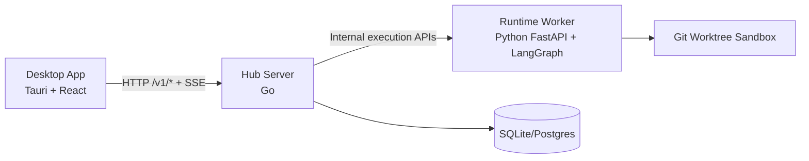

<p align="right">
  <strong>English</strong> | <a href="./README.zh-CN.md">中文</a>
</p>

<p align="center">
  
</p>

<h1 align="center">Goyais</h1>

<p align="center">
  Open-source, Hub-First, Session-Centric, local-first AI-assisted coding desktop platform.
</p>

<p align="center">
  <a href="./README.zh-CN.md">Read this in Chinese (中文文档)</a>
</p>

<p align="center">
  <a href="./LICENSE"></a>
  <a href="https://github.com/GoyacJ/Goyais/releases"></a>
  <a href="https://github.com/GoyacJ/Goyais/actions/workflows/ci.yml"></a>
</p>

<p align="center">
  <a href="#features">Features</a> ·
  <a href="#architecture">Architecture</a> ·
  <a href="#quick-start">Quick Start</a> ·
  <a href="#documentation">Docs</a> ·
  <a href="#contributing">Contributing</a> ·
  <a href="#security">Security</a>
</p>

---

## Overview

Goyais is an AI coding desktop application designed for safe and controllable execution.
It combines a desktop shell, a Hub control plane, and a runtime worker so execution state,
permissions, and audit events remain consistent.

The current stable architecture is **v0.2.0** with **Hub-First** routing and
**Session-Centric** scheduling. A session can run only one active execution at a time,
with explicit user confirmation for risky operations.

Goyais supports both **local_open** mode and **remote_auth** server mode.
In remote mode, desktop clients connect to a remote Hub with workspace-scoped access control,
and runtime workers can run on centralized server infrastructure.

## Features

- **Hub-First control plane**: desktop interacts with Hub APIs as the single source of truth.
- **Local + remote server deployment**: supports local-first development and remote multi-workspace collaboration.
- **Workspace-level isolation and RBAC**: workspace-scoped routes and permissions in `remote_auth` mode.
- **Session-Centric execution**: one active execution per session with clear conflict handling.
- **Plan mode and Agent mode**:
  - Plan mode generates a plan first and waits for approval before execution.
  - Agent mode runs autonomously with confirmation gates for risky actions.
- **Isolated Git worktree execution**: each execution runs in an isolated worktree (`goyais-exec-<id>`).
- **Mainstream model integration**: configurable model endpoints and keys, with OpenAI/Anthropic-style provider compatibility.
- **Human-in-the-loop safety**: high-risk capabilities (`write_fs`, `exec`, `network`, `delete`) require confirmation.
- **Skills and MCP extensibility**: dynamic skill sets and MCP connectors can be injected at runtime.
- **Operational resilience**: SSE event streaming, watchdog lock recovery, and audit logging.

## Architecture



### Deployment modes

- **Local mode (`local_open`)**: desktop + local Hub + local runtime worker, optimized for local development.
- **Remote mode (`remote_auth`)**: desktop connects to remote Hub with bearer auth, workspace isolation, and RBAC.

### Core modules

- `apps/desktop-tauri`: desktop UI and local shell.
- `server/hub-server-go`: primary Hub control plane.
- `runtime/python-agent`: runtime worker for task execution.
- `packages/protocol`: JSON schema and generated TS/Python protocol artifacts.

> Note: `server/hub-server` and `server/sync-server` remain in repo for compatibility/testing,
> but are not the primary v0.2.0 runtime path.

## Quick Start

### Requirements

- Node.js 22+
- pnpm 10+
- Python 3.11+
- [uv](https://docs.astral.sh/uv/)
- Go 1.24+
- Rust stable (for Tauri desktop)

Install dependencies:

```bash
pnpm install
pnpm protocol:generate
```

Start 3 processes in separate terminals:

1. Hub (Go):

```bash
PORT=8787 GOYAIS_AUTH_MODE=local_open GOYAIS_RUNTIME_SHARED_SECRET=dev-shared pnpm dev:hub
```

2. Runtime worker (Python):

```bash
GOYAIS_RUNTIME_REQUIRE_HUB_AUTH=true GOYAIS_RUNTIME_SHARED_SECRET=dev-shared GOYAIS_HUB_BASE_URL=http://127.0.0.1:8787 pnpm dev:runtime
```

3. Desktop app:

```bash
pnpm dev:desktop
```

Then create a session in the desktop app (Plan mode or Agent mode), run a task, review patch,
and commit/discard changes.

### Remote server mode (summary)

1. Deploy Hub and runtime worker services in your server environment.
2. Set Hub auth mode to `GOYAIS_AUTH_MODE=remote_auth`.
3. Connect desktop clients to the remote workspace and use workspace-scoped access control.

## Repository Layout

```text
apps/desktop-tauri        # Desktop UI and local shell
server/hub-server-go      # Primary Hub control plane (Go)
runtime/python-agent      # Runtime worker (FastAPI + LangGraph)
packages/protocol         # Protocol schemas and generated types
docs/                     # PRD, architecture, setup, and plans
```

## Development Commands

```bash
pnpm version:check
pnpm protocol:generate
pnpm typecheck
pnpm test
cd server/hub-server-go && go test ./...
```

## Documentation

- Chinese documentation: [`README.zh-CN.md`](./README.zh-CN.md)
- Product requirements: [`docs/PRD.md`](./docs/PRD.md)
- Technical architecture: [`docs/TECH-ARCHITECTURE.md`](./docs/TECH-ARCHITECTURE.md)
- Development setup: [`docs/dev-setup.md`](./docs/dev-setup.md)
- UI guidelines: [`docs/ui-guidelines.md`](./docs/ui-guidelines.md)
- ADRs: [`docs/ADR/`](./docs/ADR)

## Contributing

Contributions are welcome. Please read [`CONTRIBUTING.md`](./CONTRIBUTING.md) before opening a pull request.

## Security

Please report vulnerabilities via GitHub Private Vulnerability Reporting.
See [`SECURITY.md`](./SECURITY.md) for the disclosure policy.

## Code of Conduct

This project follows a community code of conduct.
See [`CODE_OF_CONDUCT.md`](./CODE_OF_CONDUCT.md).

## License

Licensed under the Apache License 2.0. See [`LICENSE`](./LICENSE).
