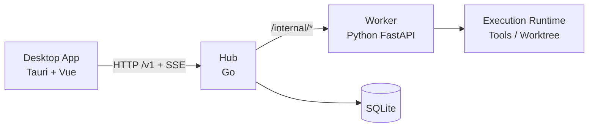

<p align="right">
  <strong>English</strong> | <a href="./README.zh-CN.md">中文</a>
</p>

<p align="center">
  
</p>

<h1 align="center">Goyais</h1>

<p align="center">
  Open-source, Hub-authoritative, Conversation-centric AI desktop platform.
</p>

<p align="center">
  <a href="./README.zh-CN.md">Read this in Chinese (中文文档)</a>
</p>

<p align="center">
  <a href="./LICENSE"></a>
  <a href="https://github.com/GoyacJ/Goyais/releases"></a>
  <a href="https://github.com/GoyacJ/Goyais/actions/workflows/ci.yml"></a>
</p>

<p align="center">
  <a href="#overview">Overview</a> ·
  <a href="#architecture">Architecture</a> ·
  <a href="#screenshots">Screenshots</a> ·
  <a href="#quick-start">Quick Start</a> ·
  <a href="#packaging-and-release">Packaging & Release</a> ·
  <a href="#documentation">Docs</a> ·
  <a href="#contributing">Contributing</a>
</p>

---

## Overview

Goyais is an open-source AI desktop platform for teams that need both delivery speed and operational control.
Instead of letting the UI call runtime tools directly, Goyais keeps a strict control plane:
`Desktop -> Hub -> Worker`.

This gives you a desktop-first experience while keeping execution authority, policy checks, and orchestration in Hub.
The product model is built around:
`Workspace -> Project -> Conversation -> Execution`.

### Why Goyais

- **Desktop-first, not browser-only**: run as a native app and keep local workflows smooth.
- **Hub-authoritative execution**: Desktop does not bypass Hub for control actions.
- **Conversation-centric runtime**: multiple conversations can run in parallel, each conversation keeps strict FIFO with only one active execution.
- **Workspace-level environment isolation**: different workspaces can keep different project contexts, resources, and execution environments.
- **Governable remote mode**: connect to remote workspaces with explicit credentials (`hub_url`, `username`, `password`) and permission-aware UI behavior.
- **Team Hub deployment model**: deploy Hub on a server, then all desktop members can connect to the same workspace.
- **Full Hub authorization model**: Hub provides complete RBAC + ABAC capability for permission and policy control.
- **Shared resource governance**: support centralized sharing and management for Rules, Skills, and MCP connectors.

### What Is Implemented in the Current Codebase

- **Three-tier stack**:
  - Desktop: `Tauri + Vue + TypeScript`
  - Hub: `Go`
  - Worker: `Python + FastAPI`
- **Out-of-the-box local mode**: Desktop starts Hub/Worker as sidecars, performs `/health` checks, and writes sidecar runtime logs under app data.
- **Execution lifecycle APIs**: conversation message submission, queueing, stop, rollback endpoint, execution events stream, diff/patch actions.
- **Conversation runtime features**: SSE event consumption, idempotent event merge, snapshot data structures, and Markdown export endpoint contract.
- **Workspace/resource surface**: local + remote workspace paths, resource/model/skills/MCP related routes, project config and agent config endpoints.
- **Release pipeline**: multi-platform Tauri packaging with sidecar binaries and tag-triggered draft GitHub Releases.

### Current Status

The repository is under active development and continuous capability hardening.
Core runtime architecture and packaging flow are in place; some API branches still intentionally return `INTERNAL_NOT_IMPLEMENTED` while features are being completed.

## Architecture



## Screenshots

### Main

<p align="center">
  
</p>

### Workspace and Settings

<p align="center">
  
  
  
</p>

### Resource and Policy Configuration

<p align="center">
  
  
  
</p>

<p align="center">
  
  
</p>

## Repository Layout

```text
apps/desktop            # Desktop app (Vue + Tauri)
apps/mobile             # Mobile app (Tauri Mobile + shared Vue code)
services/hub            # Hub service (Go)
services/worker         # Worker service (Python)
scripts/                # Dev/release scripts
docs/                   # Product/architecture/dev docs
```

## Quick Start

### Requirements

- Node.js 22+ (CI uses Node 24)
- pnpm 10.11+
- Go 1.24+
- Python 3.11+
- [uv](https://docs.astral.sh/uv/)
- Rust stable (Tauri)

### Install

```bash
pnpm install
```

### Run desktop (recommended)

```bash
pnpm run dev:desktop
```

This command runs `tauri dev` and auto-prepares local sidecars (`goyais-hub` / `goyais-worker`) when missing.

### Run mobile (remote-hub mode)

```bash
pnpm run dev:mobile
```

You can also run per-platform commands under `apps/mobile`:

```bash
cd apps/mobile
pnpm dev:ios
pnpm dev:android
```

For mobile runtime, set `VITE_HUB_BASE_URL` to your remote Hub endpoint. In release mode, `http://` is rejected by default.

### Run services separately (debug mode)

```bash
make dev-hub
make dev-worker
make dev-web
```

### Health checks

```bash
curl http://127.0.0.1:8787/health
curl http://127.0.0.1:8788/health
```

### Logs

Desktop sidecar runtime log:

```text
~/Library/Application Support/com.goyais.desktop/sidecar.log
```

## Testing & Quality

```bash
make test
make lint
pnpm --filter @goyais/desktop test:strict
pnpm --filter @goyais/desktop coverage:gate
```

## Packaging and Release

### Build local installer/package (current host target)

```bash
TARGET_TRIPLE="$(rustc -vV | awk '/^host:/ {print $2}')"
pnpm --filter @goyais/desktop sidecar:prepare
cd apps/desktop
VITE_API_MODE=strict VITE_ENABLE_MOCK_FALLBACK=false pnpm tauri build -- --target "$TARGET_TRIPLE" --no-sign
```

### Build sidecars manually

```bash
TARGET_TRIPLE="$(rustc -vV | awk '/^host:/ {print $2}')"
scripts/release/build-hub-sidecar.sh "$TARGET_TRIPLE"
scripts/release/build-worker-sidecar.sh "$TARGET_TRIPLE"
```

By default, release artifacts are built with `--no-sign` and uploaded to a draft release.

## Documentation

- Chinese README: [`README.zh-CN.md`](./README.zh-CN.md)

## Contributing

Contributions are welcome. Please read [`CONTRIBUTING.md`](./CONTRIBUTING.md) before opening a pull request.

## Security

Please report vulnerabilities via GitHub Private Vulnerability Reporting.
See [`SECURITY.md`](./SECURITY.md) for the disclosure policy.

## Code of Conduct

This project follows a community code of conduct.
See [`CODE_OF_CONDUCT.md`](./CODE_OF_CONDUCT.md).

## License

Licensed under the Apache License 2.0. See [`LICENSE`](./LICENSE).
