<p align="right">
  <a href="./README.md">English</a> | <strong>中文</strong>
</p>

<p align="center">
  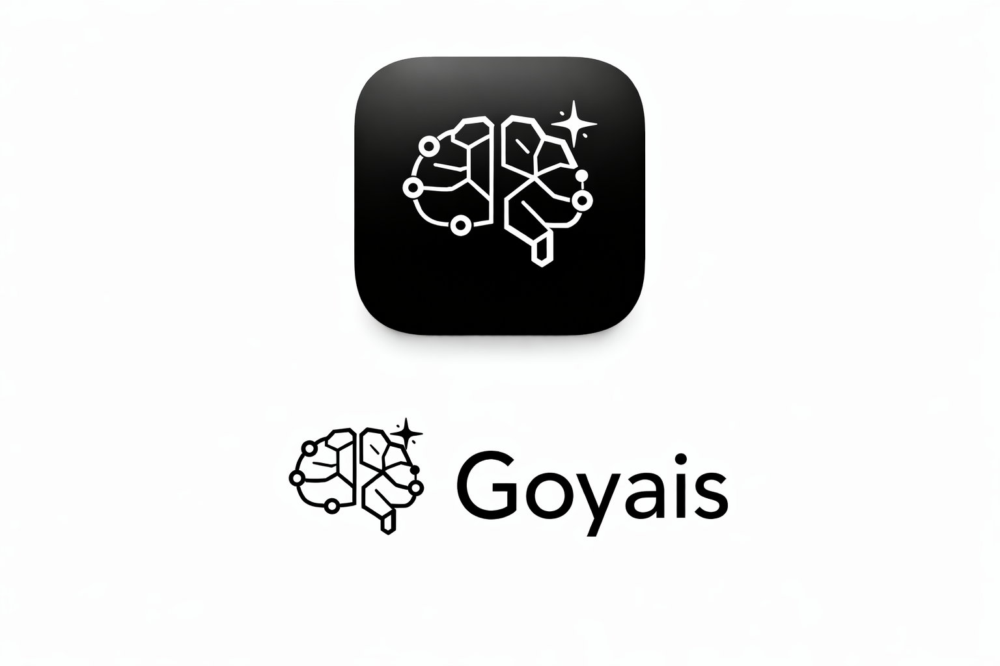
</p>

<h1 align="center">Goyais</h1>

<p align="center">
  开源、Hub 权威控制、Conversation 中心化的 AI 桌面平台。
</p>

<p align="center">
  <a href="./README.md">View English README</a>
</p>

<p align="center">
  <a href="./LICENSE"></a>
  <a href="https://github.com/GoyacJ/Goyais/releases"></a>
  <a href="https://github.com/GoyacJ/Goyais/actions/workflows/ci.yml"></a>
</p>

<p align="center">
  <a href="#项目概览">项目概览</a> ·
  <a href="#系统架构">系统架构</a> ·
  <a href="#界面截图">界面截图</a> ·
  <a href="#快速开始">快速开始</a> ·
  <a href="#打包与发版">打包与发版</a> ·
  <a href="#文档索引">文档索引</a> ·
  <a href="#参与贡献">参与贡献</a>
</p>

---

## 项目概览

Goyais 是一个面向团队协作的开源 AI 桌面平台，目标是在“交付效率”和“运行治理”之间取得平衡。
它不让 UI 直接控制执行引擎，而是坚持明确的控制平面：
`Desktop -> Hub -> Worker`。

这种架构让你获得原生桌面体验，同时把执行权威、策略校验和调度统一收敛到 Hub。
产品对象模型固定为：
`Workspace -> Project -> Conversation -> Execution`。

### 为什么是 Goyais

- **桌面优先，而非纯浏览器形态**：以原生应用承载日常开发与协作流程。
- **Hub 权威执行**：Desktop 不绕过 Hub 发起权威控制动作。
- **Conversation 中心运行时**：多 Conversation 可并行；单 Conversation 严格 FIFO，且同一时刻仅一个活动执行。
- **工作区级环境隔离**：支持不同工作区使用不同项目上下文、资源配置与执行环境。
- **可治理的远程模式**：远程工作区使用显式连接信息（`hub_url`、`username`、`password`），并支持按权限动态渲染导航。
- **团队 Hub 部署模式**：只需将 Hub 部署到服务器，即可让团队成员通过 Desktop 连接并使用同一工作区。
- **完整权限能力**：Hub 支持完整的 RBAC + ABAC 权限与策略控制能力。
- **共享资源治理**：支持 Rules、Skills、MCP 的集中共享与管理。

### 当前代码库已落地能力

- **三层技术栈**：
  - Desktop：`Tauri + Vue + TypeScript`
  - Hub：`Go`
  - Worker：`Python + FastAPI`
- **开箱即用本地模式**：Desktop 启动时自动拉起 Hub/Worker sidecar，执行 `/health` 健康检查，并把 sidecar 日志写入应用数据目录。
- **执行生命周期能力**：支持消息提交、队列排队、停止执行、回滚接口、执行事件流、diff/patch 动作。
- **Conversation 运行时能力**：支持 SSE 事件消费、事件幂等合并、快照结构，以及 Markdown 导出接口契约。
- **工作区与资源能力面**：覆盖本地/远程工作区、模型/规则/技能/MCP 相关接口、项目配置与 Agent 配置接口。
- **发布流水线能力**：支持 sidecar 集成打包、三平台构建，以及 Tag 触发的 GitHub Draft Release。

### 当前状态说明

仓库处于持续迭代与能力补齐阶段。
核心运行时架构与发布链路已打通，但部分 API 分支仍会返回 `INTERNAL_NOT_IMPLEMENTED`，属于持续补齐中的实现项。

## 系统架构

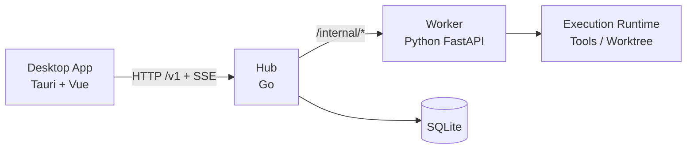

## 界面截图

### 主界面

<p align="center">
  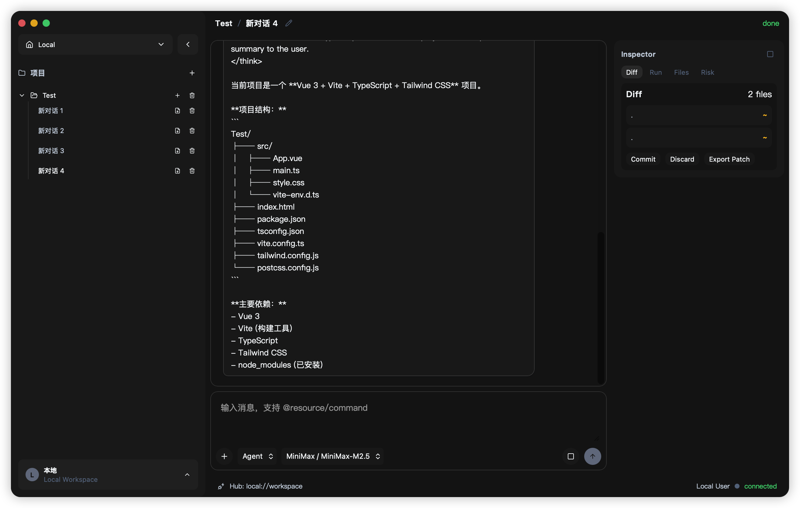
</p>

### 工作区与设置

<p align="center">
  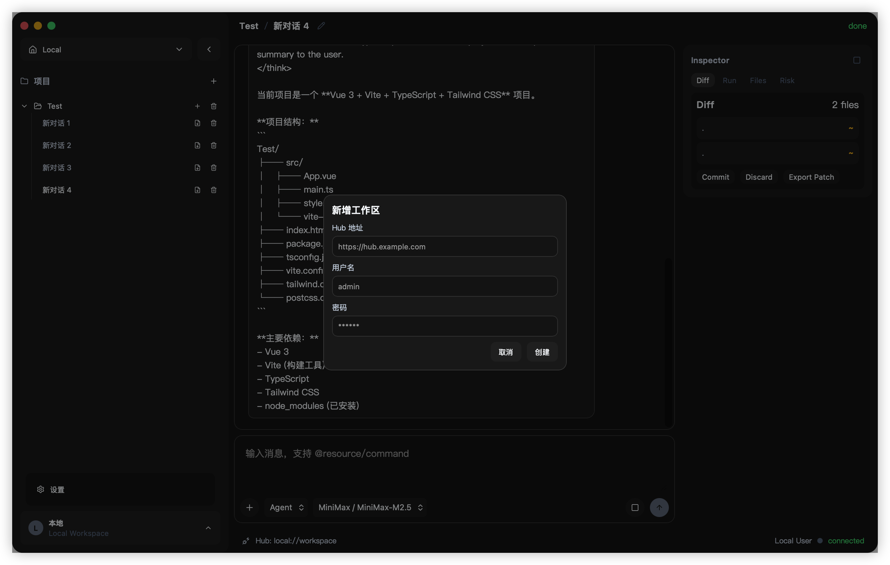
  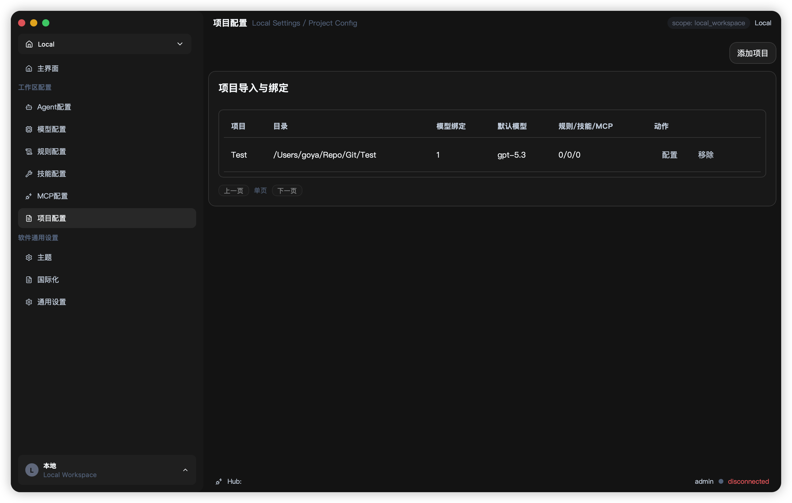
  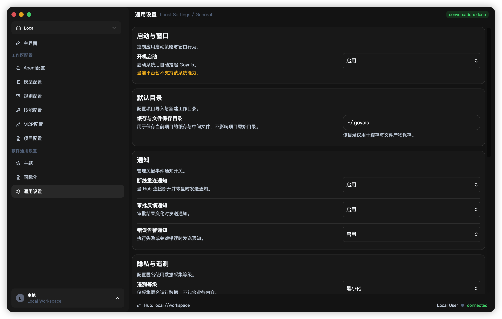
</p>

### 资源与策略配置

<p align="center">
  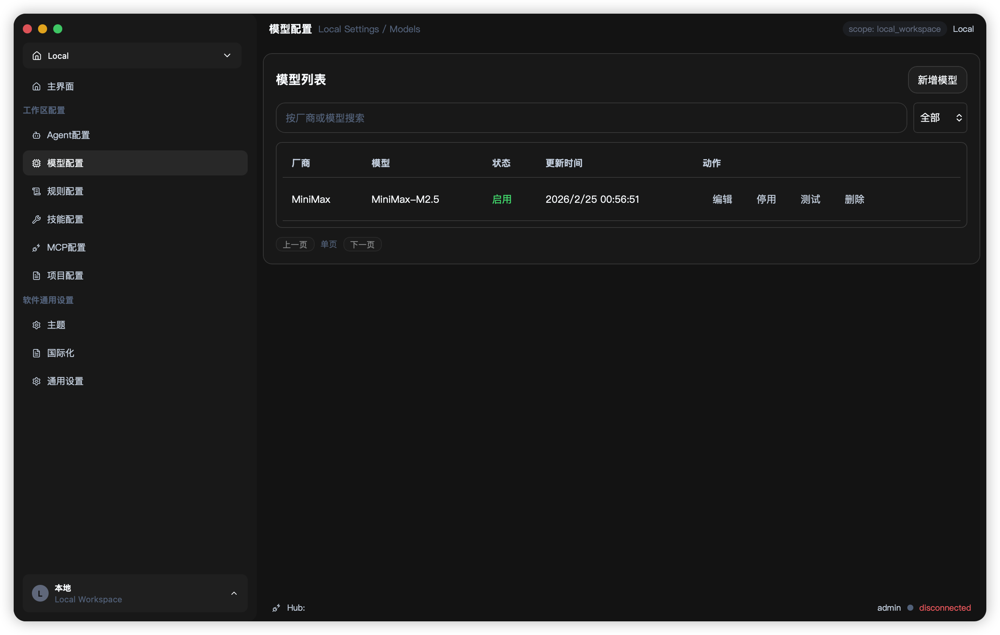
  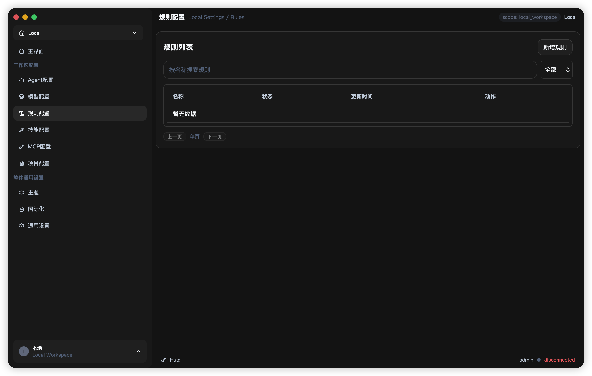
  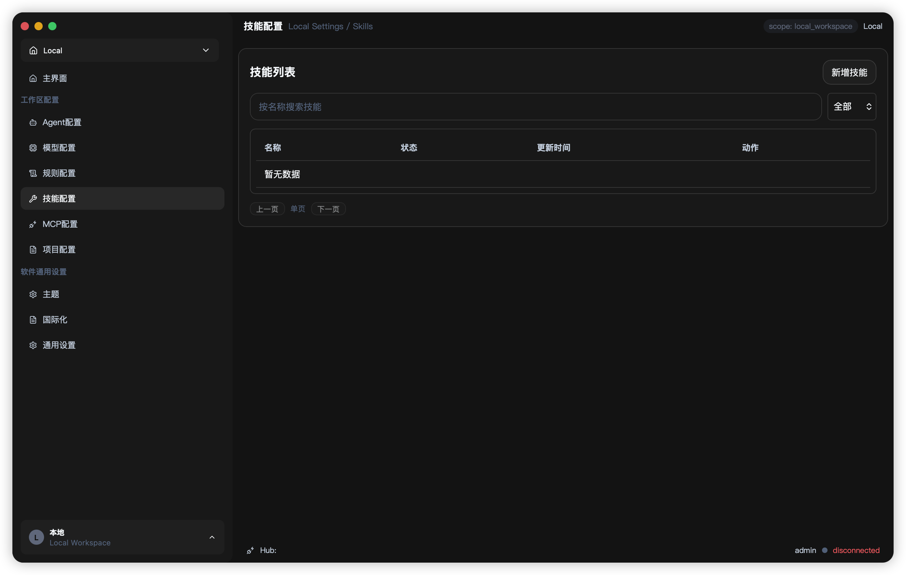
</p>

<p align="center">
  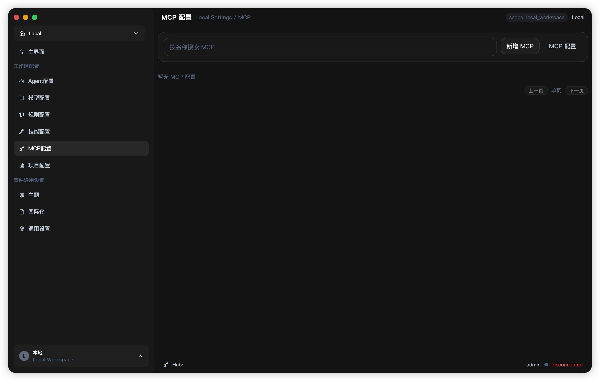
  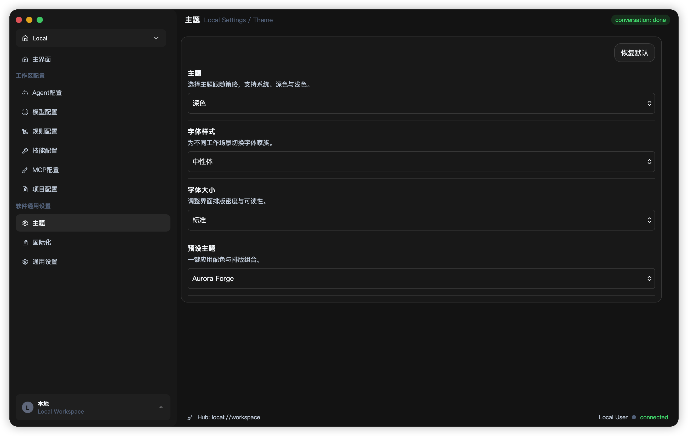
</p>

## 仓库结构

```text
apps/desktop            # 桌面应用（Vue + Tauri）
apps/mobile             # 移动端应用（Tauri Mobile + 复用 Vue 代码）
services/hub            # Hub 服务（Go）
services/worker         # Worker 服务（Python）
scripts/                # 开发/发版脚本
docs/                   # 产品/架构/开发文档
```

## 快速开始

### 环境要求

- Node.js 22+（CI 使用 Node 24）
- pnpm 10.11+
- Go 1.24+
- Python 3.11+
- [uv](https://docs.astral.sh/uv/)
- Rust stable（Tauri）

### 安装依赖

```bash
pnpm install
```

### 启动桌面端（推荐）

```bash
pnpm run dev:desktop
```

该命令会执行 `tauri dev`，并在本机缺失时自动准备 sidecar（`goyais-hub` / `goyais-worker`）。

### 启动移动端（远程 Hub 模式）

```bash
pnpm run dev:mobile
```

也可以进入 `apps/mobile` 分平台启动：

```bash
cd apps/mobile
pnpm dev:ios
pnpm dev:android
```

移动端运行需要配置 `VITE_HUB_BASE_URL` 指向远程 Hub；release 默认拒绝 `http://` 连接。

### 分体调试模式（可选）

```bash
make dev-hub
make dev-worker
make dev-web
```

### 健康检查

```bash
curl http://127.0.0.1:8787/health
curl http://127.0.0.1:8788/health
```

### 日志位置

Desktop sidecar 运行日志：

```text
~/Library/Application Support/com.goyais.desktop/sidecar.log
```

## 测试与质量门禁

```bash
make test
make lint
pnpm --filter @goyais/desktop test:strict
pnpm --filter @goyais/desktop coverage:gate
```

## 打包与发版

### 本机构建安装包（当前主机目标）

```bash
TARGET_TRIPLE="$(rustc -vV | awk '/^host:/ {print $2}')"
pnpm --filter @goyais/desktop sidecar:prepare
cd apps/desktop
VITE_API_MODE=strict VITE_ENABLE_MOCK_FALLBACK=false pnpm tauri build -- --target "$TARGET_TRIPLE" --no-sign
```

### 手工构建 sidecar

```bash
TARGET_TRIPLE="$(rustc -vV | awk '/^host:/ {print $2}')"
scripts/release/build-hub-sidecar.sh "$TARGET_TRIPLE"
scripts/release/build-worker-sidecar.sh "$TARGET_TRIPLE"
```

默认使用 `--no-sign` 构建并上传到草稿 Release。

## 文档索引

- 英文 README：[`README.md`](./README.md)

## 参与贡献

欢迎提交 Issue 和 PR。请先阅读 [`CONTRIBUTING.md`](./CONTRIBUTING.md)。

## 安全披露

请通过 GitHub 私密漏洞报告通道提交安全问题。
详细流程见 [`SECURITY.md`](./SECURITY.md)。

## 行为准则

本项目遵循社区协作行为准则，详见 [`CODE_OF_CONDUCT.md`](./CODE_OF_CONDUCT.md)。

## 许可证

本项目采用 Apache License 2.0，详见 [`LICENSE`](./LICENSE)。
