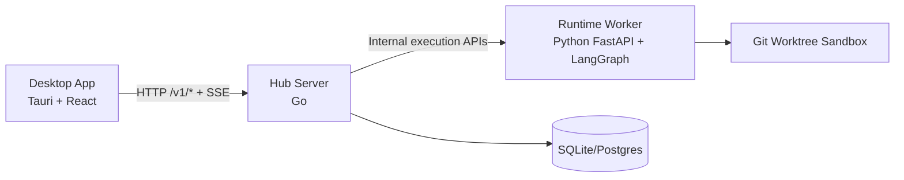

<p align="right">
  <a href="./README.md">English</a> | <strong>中文</strong>
</p>

<p align="center">
  
</p>

<h1 align="center">Goyais</h1>

<p align="center">
  开源、Hub-First、Session-Centric、本地优先的 AI 辅助编码桌面平台。
</p>

<p align="center">
  <a href="./README.md">查看英文文档 (English README)</a>
</p>

<p align="center">
  <a href="./LICENSE"></a>
  <a href="https://github.com/GoyacJ/Goyais/releases"></a>
  <a href="https://github.com/GoyacJ/Goyais/actions/workflows/ci.yml"></a>
</p>

<p align="center">
  <a href="#功能特性">功能特性</a> ·
  <a href="#系统架构">系统架构</a> ·
  <a href="#快速开始">快速开始</a> ·
  <a href="#文档索引">文档索引</a> ·
  <a href="#参与贡献">参与贡献</a> ·
  <a href="#安全披露">安全披露</a>
</p>

---

## 项目概览

Goyais 是一个面向安全与可控执行的 AI 编码桌面应用。
系统由桌面端、Hub 控制面和 Runtime Worker 构成，统一管理执行状态、权限确认与审计事件。

当前稳定架构版本为 **v0.2.0**，核心设计为 **Hub-First** 与 **Session-Centric**：
同一 Session 同时仅允许一个活动执行；高风险操作必须经过用户确认。

Goyais 同时支持 **local_open** 本地模式与 **remote_auth** 远程服务器模式。
在远程模式下，桌面端连接远程 Hub，通过工作区级访问控制进行隔离，Runtime Worker 可部署在集中式服务器环境。

## 功能特性

- **Hub-First 控制面**：桌面端统一通过 Hub API 访问系统能力，Hub 是状态权威。
- **本地 + 远程服务器模式**：同时支持本地优先开发与远程多工作区协作。
- **工作区级隔离与 RBAC**：在 `remote_auth` 模式下执行工作区级路由与权限控制。
- **Session-Centric 执行模型**：每个 Session 单活执行，冲突时返回明确状态。
- **Plan 模式与 Agent 模式**：
  - Plan 模式先产出计划，审批后执行。
  - Agent 模式可自主执行，但高风险动作会被确认门禁拦截。
- **Git Worktree 隔离执行**：每次任务在隔离工作树 `goyais-exec-<id>` 中运行。
- **主流模型接入**：支持可配置模型端点与密钥，兼容 OpenAI/Anthropic 风格的 Provider 接入。
- **Human-in-the-loop 安全机制**：`write_fs`、`exec`、`network`、`delete` 等能力默认需确认。
- **Skills 与 MCP 扩展**：支持动态注入技能集与 MCP Connector。
- **运行稳定性**：支持 SSE 事件流、看门狗超时回收与审计日志。

## 系统架构



### 部署模式

- **本地模式（`local_open`）**：桌面端 + 本地 Hub + 本地 Runtime Worker，适合单机开发。
- **远程模式（`remote_auth`）**：桌面端连接远程 Hub，使用 Bearer 鉴权、工作区隔离与 RBAC。

### 核心模块

- `apps/desktop-tauri`：桌面应用与 UI。
- `server/hub-server-go`：主要 Hub 控制面服务。
- `runtime/python-agent`：任务执行 Worker。
- `packages/protocol`：跨语言协议（JSON Schema + TS/Python 生成产物）。

> 说明：`server/hub-server` 与 `server/sync-server` 当前保留用于兼容/测试，不是 v0.2.0 的主运行路径。

## 快速开始

### 环境要求

- Node.js 22+
- pnpm 10+
- Python 3.11+
- [uv](https://docs.astral.sh/uv/)
- Go 1.24+
- Rust stable（Tauri 构建所需）

安装依赖：

```bash
pnpm install
pnpm protocol:generate
```

在 3 个终端分别启动：

1. 启动 Hub（Go）：

```bash
PORT=8787 GOYAIS_AUTH_MODE=local_open GOYAIS_RUNTIME_SHARED_SECRET=dev-shared pnpm dev:hub
```

2. 启动 Runtime Worker（Python）：

```bash
GOYAIS_RUNTIME_REQUIRE_HUB_AUTH=true GOYAIS_RUNTIME_SHARED_SECRET=dev-shared GOYAIS_HUB_BASE_URL=http://127.0.0.1:8787 pnpm dev:runtime
```

3. 启动桌面端：

```bash
pnpm dev:desktop
```

随后在桌面端创建 Session（Plan 或 Agent），执行任务并在 UI 中审阅 patch，再进行 commit/discard。

### 远程服务器模式（概要）

1. 在服务器环境部署 Hub 与 Runtime Worker 服务。
2. 将 Hub 认证模式设置为 `GOYAIS_AUTH_MODE=remote_auth`。
3. 桌面端连接远程工作区，按工作区级访问控制进行协作。

## 仓库结构

```text
apps/desktop-tauri        # 桌面 UI 与本地应用壳
server/hub-server-go      # 主要 Hub 控制面（Go）
runtime/python-agent      # Runtime Worker（FastAPI + LangGraph）
packages/protocol         # 协议定义与生成类型
docs/                     # PRD、架构、开发说明与计划文档
```

## 常用开发命令

```bash
pnpm version:check
pnpm protocol:generate
pnpm typecheck
pnpm test
cd server/hub-server-go && go test ./...
```

## 文档索引

- 英文文档：[`README.md`](./README.md)
- 产品需求文档：[`docs/PRD.md`](./docs/PRD.md)
- 技术架构文档：[`docs/TECH-ARCHITECTURE.md`](./docs/TECH-ARCHITECTURE.md)
- 开发环境说明：[`docs/dev-setup.md`](./docs/dev-setup.md)
- UI 规范：[`docs/ui-guidelines.md`](./docs/ui-guidelines.md)
- ADR 决策记录：[`docs/ADR/`](./docs/ADR)

## 参与贡献

欢迎提交 Issue 和 PR。请先阅读 [`CONTRIBUTING.md`](./CONTRIBUTING.md)。

## 安全披露

请通过 GitHub 私密漏洞报告通道提交安全问题。
详细流程见 [`SECURITY.md`](./SECURITY.md)。

## 开源协作说明

本仓库的治理文档（贡献指南、安全策略、行为准则）以英文主文为准：

- [`CONTRIBUTING.md`](./CONTRIBUTING.md)
- [`SECURITY.md`](./SECURITY.md)
- [`CODE_OF_CONDUCT.md`](./CODE_OF_CONDUCT.md)

## 许可证

本项目采用 Apache License 2.0，详见 [`LICENSE`](./LICENSE)。
