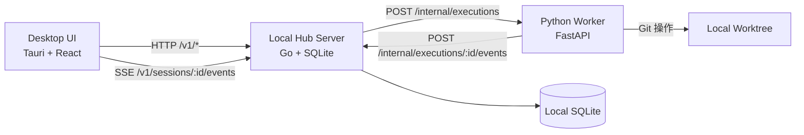
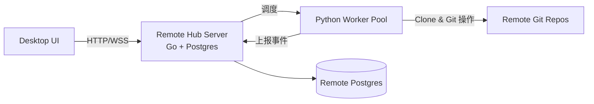

# Goyais 技术架构说明

## 1. 文档信息
- 版本：v0.2.0
- 更新时间：2026-02-21
- 适用范围：v0.2.0 (Hub-First + Session-Centric 重构后)

## 2. 架构目标与原则
- 统一架构 (Hub-First)：彻底消除 Local / Remote 模式的代码分叉，Local 模式同样启动 Local Hub 服务。
- 数据与状态权威：Hub Server（Go）是所有 Session、Execution、Events、配置信息的权威数据源和状态机。
- 互斥执行与事务：同一个 Session 同一时间只允许一个 Active Execution，保证原子性和并发安全。
- 隔离与安全：
  - Worker 执行默认在隔离的 Git Worktree 中进行，变更通过 Git Commit 持久化。
  - Remote 环境中，Desktop -> Hub -> Worker，Runtime 不暴露给客户端，所有敏感操作经过 Hub 代理和权限校验。
- 扩展性：动态加载与注入 Skills 和 MCP Connectors 到 Worker。

## 3. 系统拓扑 (v0.2.0 Hub-First)

### 3.1 本地模式 (Local)

### 3.2 远程模式 (Remote)

## 4. Monorepo 模块边界
- `apps/desktop-tauri`：桌面应用、UI、状态管理、唯一的数据源 (`hubClient`)。
- `server/hub-server-go`：控制面核心、会话状态权威、RBAC、远程仓库同步、SSE 事件分发。
- `runtime/python-agent`：纯粹的任务执行 Worker、隔离工作区、调用 LLM、注入 MCP/Skills。
- `packages/protocol`：JSON Schema 定义的跨语言协议、生成的 TS/Python/Go 类型。
- `server/hub-server` & `server/sync-server`：历史遗留旧版架构实现（已归档，不再参与运行）。

## 5. 模块级设计

### 5.1 Desktop（Tauri + React）
- 应用壳层：`AppLayout + Sidebar + SettingsSidebar + StatusBar`。
- 运行页面：`ConversationPage` 聚合 Timeline/Diff/Plan Mode Approval/Execution Actions。
- 状态管理：Zustand (`executionStore`, `conversationStore`, `permissionStore`) + React Query。
- 数据访问：统一通过 `hubClient.ts` 和 `sessionDataSource.ts` 与 Hub 进行通信。
- 本地模式自动启动：Tauri Supervisor 负责拉起 `hub-server-go` 和 `python-agent`。

### 5.2 Hub Server (Go 1.23+ + chi + sqlc)
- API 层：提供符合 RESTful 标准的 API，暴露 `/v1/sessions`, `/v1/executions`, `/v1/projects`, `/v1/skill-sets` 等路由。
- 调度层 (`ExecutionScheduler`)：管理 Session 的 Active Execution Mutex 锁，进行冲突检测 (409 SESSION_BUSY)。
- 推送层 (`SSEManager`)：为每个连接维护 goroutine，进行 `last_event_ts` 的断点续传。
- 同步层 (`ProjectSyncService`)：接管外部 Git 仓库的 clone、fetch 和 pull。
- 监控层 (`Watchdog`)：定期扫描心跳超时的 Execution 并清理死锁。

### 5.3 Runtime Worker (FastAPI + LangGraph)
- 受控执行：不再自行管理 DB 或 Session，仅接收 `/internal/executions` 请求。
- 隔离机制：使用 `git worktree add` 创建独立的执行副本。
- 工具注入：`ToolInjector` 动态读取 Hub 中的 Skills 和 MCP Connector 配置并组装。
- Agent 模式：
  - `Plan 模式`：输出执行计划 -> 暂停并等待 Hub 返回 User Confirmation -> 确认后执行具体 Tools。
  - `Agent 模式`：自主运行 -> 敏感操作 (write_fs, exec) 挂起等待确认 -> 继续运行。
- 事件上报：使用 `HubReporter` 将产生的事件批量 POST 到 Hub。

## 6. 数据架构 (Hub 权威)

### 6.1 Hub DB（核心表）
- 会话与执行：`sessions`, `executions`, `execution_events`, `tool_confirmations`
- 资产管理：`projects`, `model_configs`, `skill_sets`, `skills`, `mcp_connectors`
- 权限与审计：`users`, `workspaces`, `audit_logs`

### 6.2 Worker 临时状态
- Worker 仅在内存中维护一个轻量的 ring buffer 用于事件批量上传失败的重试，不使用 SQLite 持久化任何业务数据。

## 7. 安全与隔离架构
- 文件系统隔离：所有改动默认发生在 ephemeral worktree `goyais-exec-<id>` 中。
- 用户确认：敏感工具 (如执行终端命令、修改文件) 和 Git 提交操作必须经过人机确认 (`tool_confirmations`)。
- Hub -> Worker 鉴权：Hub 与 Worker 之间通过共享密钥 (`X-Hub-Auth`) 进行验证。
- 密码学安全：Hub 使用 AES-256-GCM 加密存储敏感凭证 (如 API Keys 和 Auth Refs)。

## 8. 可观测性架构
- Trace ID 贯穿：Hub 为每次 execution 生成唯一的 `trace_id`，并透传到 Worker，最终写入所有日志和事件。
- 审计日志：所有关键操作 (Session CRUD, tool_call, confirmation, commit, sync) 强制记录在 `audit_logs` 表。

## 9. 演进路线（未来展望）
- 阶段 A：进一步完善远端 Worker Pool 的分布式调度与负载均衡。
- 阶段 B：实现真正的执行队列机制 (Execution Queueing)，替代目前的 409 Busy 拒绝策略。
- 阶段 C：完善 Workspace 级别的细粒度配额控制 (并发限制等)。

