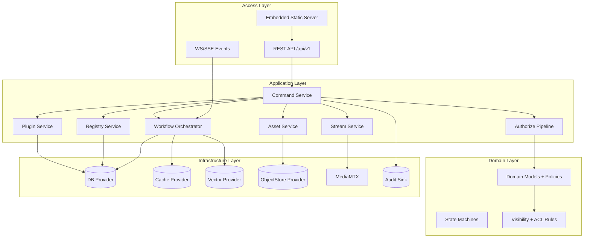
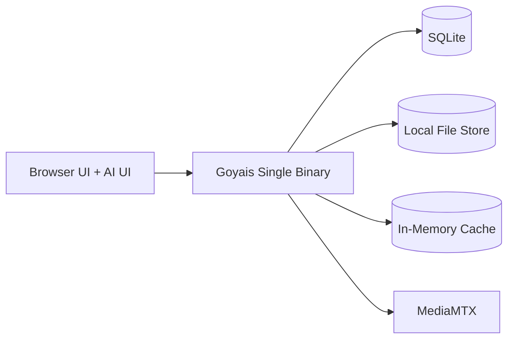
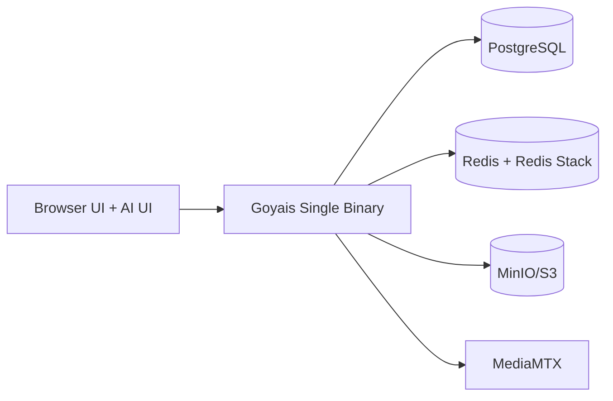

# Goyais v0.1 架构总览

## 1. 目标与边界

v0.1 目标是构建可闭环的多模态 AI 编排平台基础能力，确保：
- AI 与 UI 双入口一致（Command-first）。
- 统一权限与可见性（Agent-as-User + RBAC + ACL + Egress）。
- 最小化运行可落地（SQLite + MediaMTX + 本地文件 + 本地缓存）。
- 生产发布采用单二进制（Go embed 前端 dist）。

v0.1 非目标：多人实时协同、复杂子图复用、计费结算、深度供应链扫描。

## 2. 分层架构

## 3. 模块边界与职责

| 模块 | 职责 | 不负责 |
|---|---|---|
| Command Service | Validate/Authorize/Execute/Audit 主流程；统一副作用入口 | 业务侧复杂计算 |
| AuthZ | RBAC、Visibility、ACL、Egress 多闸门判定 | 实际资源写入 |
| Workflow Orchestrator | 模板实例化、Run/Step 调度、重试与回放 | 身份认证 |
| Registry | Capability/Algorithm/Provider 元数据与版本查询 | 插件安装执行 |
| Plugin Service | 包上传/安装/启停/回滚与依赖校验 | 具体算法执行 |
| Stream Service | MediaMTX path 控制、录制、事件触发 | 业务分析算法 |
| Asset Service | 文件元数据、血缘、可见性与共享 | 画布编辑逻辑 |
| Audit Service | 命令与授权、外发与状态迁移审计 | 业务流程控制 |

## 4. 核心抽象接口（契约）

### 4.1 DBProvider
- 目标：屏蔽 SQLite/PostgreSQL 差异。
- 必需能力：事务、分页查询、乐观并发字段支持、迁移版本记录。

### 4.2 CacheProvider
- 目标：统一 memory/Redis 缓存。
- 必需能力：`get/set/del`、TTL、简单分布式锁（可选）。
- v0.1 当前实现：`memory` 与 `redis` provider 可用（最小接口：`get/set/del/ttl`）。

### 4.3 VectorProvider
- 目标：统一 Redis Stack 向量检索与 SQLite fallback。
- 必需能力：索引写入、相似度查询、按租户/工作区过滤。
- v0.1 当前实现：`sqlite` fallback 与 `redis_stack` provider 可用（最小接口：`upsert/search`）。

### 4.4 ObjectStoreProvider
- 目标：统一 local/MinIO/S3 文件对象读写。
- 必需能力：put/get/delete、预签名 URL（可选）、元数据标签。
- v0.1 当前实现：
  - `local`：已实现（最小闭环）
  - `minio/s3`：已实现 provider 级 `put/get/delete/ping`，可与 full profile 组合验证

### 4.5 StreamProvider
- 目标：统一 MediaMTX 控制面交互。
- 必需能力：创建/更新/删除流、鉴权、录制控制、状态采集、事件桥接。

### 4.6 EventBusProvider
- 目标：统一内存队列与 Kafka 事件总线。
- 必需能力：发布 command/stream 事件、消费者组订阅、最小健康探测。
- v0.2 预研约束：外部写路径不新增，事件触发仍回到 command gate。

## 5. 运行拓扑

### 5.1 最小化运行拓扑（v0.1 必须闭环）

默认值：
- `db.driver=sqlite`
- `cache.provider=memory`
- `vector.provider=sqlite`
- `object_store.provider=local`
- `stream.provider=mediamtx`
- `event_bus.provider=memory`

### 5.2 完整模式拓扑（推荐）

## 6. 单二进制发布与静态路由策略（冻结）

### 6.1 发布策略
- 生产环境必须打包为单二进制（Go embed Vite dist）。
- 构建命令：`make build`。
- 开发模式可使用 Vite dev + API proxy，不改变生产策略。

### 6.2 路由优先级（固定）
1. `/api/v1/*` → API 路由。
2. 命中 embed 静态文件路径 → 返回静态文件。
3. 特殊路径策略：
   - `/favicon.ico`：若文件不存在，返回 404。
   - `/robots.txt`：若文件不存在，返回 404。
4. 其余 GET 前端路由（如 `/`、`/canvas`）→ 返回 `index.html`（SPA fallback）。

### 6.3 Header 策略（固定）
- embed 静态文件必须返回正确 `Content-Type`。
- `index.html`（包括 `/` 与 SPA fallback 命中）必须返回：
  - `Cache-Control: no-store`

## 7. API 与执行链路

Command 执行管道（必须）：
1. Validate：schema 与字段约束。
2. Authorize：Tenant/Visibility/ACL/RBAC/Egress。
3. Execute：执行业务动作并触发事件。
4. Audit：记录 `allow/deny`、原因与影响资源。
5. Event：向 UI 推送 run/step 状态。

审计与追踪补充约束（v0.1 当前实现）：
- 每次 command 至少产生 `command.authorize`、`command.execute` 与 `command.egress` 审计记录。
- 审计 payload 统一包含 `initiator/context/authzResult/resourceImpact`；`command.egress` 仅记录摘要（digest/bytes），不落敏感原文。
- `X-Trace-Id`（缺省由服务端生成）写入 command 审计，并透传到 `workflow_runs.trace_id` 与 `step_runs.trace_id`，对外返回 `traceId` 字段用于串联查询。

### 7.1 上下文选择
- 默认使用 JWT claims 中的 `tenantId/workspaceId/userId/roles`。
- 可通过 `X-Workspace-Id`（可选 `X-Tenant-Id`）切换。
- 服务端必须验证 header 目标在 JWT 可访问范围内。
- 上下文模式由 `GOYAIS_AUTH_CONTEXT_MODE` 控制：
  - `jwt_or_header`（默认）：若请求携带有效 Bearer JWT，则优先使用 JWT claims，上下文 header 仅允许在 claims 可访问范围内覆盖；若无有效 JWT，则回退为 header 必填模式。
  - `header_only`：忽略 JWT，强制 `X-Tenant-Id/X-Workspace-Id/X-User-Id` 必填。
- header 越权覆盖（跨 tenant/workspace 或越权角色）返回 `403 FORBIDDEN + error.authz.forbidden`。
- Bearer token 格式或 claims 非法返回 `400 INVALID_TOKEN + error.context.invalid_token`。

### 7.2 Header 回退模式
- 当 `GOYAIS_AUTH_CONTEXT_MODE=header_only` 或请求未携带有效 Bearer JWT 时，`/api/v1/commands*`、`/api/v1/workflow-*`、`/api/v1/assets*`、`/api/v1/shares*` 请求必须携带：
  - `X-Tenant-Id`
  - `X-Workspace-Id`
  - `X-User-Id`
- 可选上下文头：
  - `X-Roles`（逗号分隔，缺省视为 `member`）
  - `X-Policy-Version`（缺省 `v0.1`）
  - `X-Trace-Id`（缺省由服务端生成）
- 服务端映射：`ownerId = X-User-Id`。
- 缺任一 header 返回：`400 MISSING_CONTEXT + error.context.missing`，并在 `details.missingHeaders` 返回缺失列表。
- `GET /api/v1/system/healthz` 作为 `GET /api/v1/healthz` 的别名端点，返回结构一致。
- `GET /api/v1/healthz` 与 `GET /api/v1/system/healthz` 返回：
  - `providers`（当前生效 provider 选择）
  - `details.providers.*.status`（`ready/degraded`）与可选 `error`
  - 新增 `details.providers.event_bus`（事件总线就绪态）

### 7.3 当前接口落地状态（2026-02）
- 已落地（可用）：
  - `commands`
    - `GET /commands`、`GET /commands/{commandId}` 返回 `acceptedAt` 与 `traceId`（`traceId` 来自同 command 审计链路聚合）
  - `shares`（`resourceType=command|asset`）：
    - `GET /shares` 直接查询
    - `POST /shares`、`DELETE /shares/{shareId}` 均为 domain sugar，转换为 `share.create/share.delete` command 执行，并返回 `resource + commandRef`
  - `assets`：
    - `GET /assets`、`GET /assets/{id}`
    - `POST /assets`（domain sugar -> `asset.upload` command）
    - `PATCH /assets/{assetId}`（domain sugar -> `asset.update` command）
    - `DELETE /assets/{assetId}`（domain sugar -> `asset.delete` command）
    - `GET /assets/{assetId}/lineage`（read path）
    - 受 `GOYAIS_FEATURE_ASSET_LIFECYCLE` 控制：开启时返回真实能力，关闭时返回 `501 NOT_IMPLEMENTED`
  - `registry`（C1 read-only）：
    - `GET /registry/capabilities`
    - `GET /registry/capabilities/{capabilityId}`
    - `GET /registry/algorithms`
    - `GET /registry/algorithms/{algorithmId}`
    - `GET /registry/providers`
    - 列表统一支持 `cursor` 优先于 `page/pageSize`
  - `workflow`：
    - `GET/POST /workflow-templates`
    - `GET /workflow-templates/{templateId}`
    - `POST /workflow-templates/{templateId}:patch`
    - `POST /workflow-templates/{templateId}:publish`
    - `GET/POST /workflow-runs`
    - `GET /workflow-runs/{runId}`
    - `POST /workflow-runs/{runId}:cancel`
    - `GET /workflow-runs/{runId}/steps`
    - `POST /commands` with `commandType=workflow.retry`（仅命令入口，不新增 domain retry 路由）
    - 写接口全部走 command-first（domain sugar -> `workflow.*` command）
  - `plugin-market`（C2 MVP）：
    - `GET /plugin-market/packages`
    - `POST /plugin-market/packages`（domain sugar -> `plugin.upload` command）
    - `POST /plugin-market/installs`（domain sugar -> `plugin.install` command）
    - `POST /plugin-market/installs/{installId}:enable|:disable|:rollback`（domain sugar -> `plugin.enable|plugin.disable|plugin.rollback` command）
  - `streams`（D1 MVP）：
    - `GET /streams`
    - `POST /streams`（domain sugar -> `stream.create` command）
    - `GET /streams/{streamId}`
    - `POST /streams/{streamId}:record-start`（domain sugar -> `stream.record.start` command）
    - `POST /streams/{streamId}:record-stop`（domain sugar -> `stream.record.stop` command）
    - `POST /streams/{streamId}:kick`（domain sugar -> `stream.kick` command）
    - `record-stop` 成功后写入 `asset_lineage`（`relation=recorded_from`）
    - `onPublishTemplateId` 存在时，发布 `stream.on_publish` 事件；Kafka consumer 收到后通过 command gate 触发一次 `workflow.run`（幂等键 `stream-onpublish-<recordingId>`）
  - `algorithms`（MVP 已落地）：
    - `POST /algorithms/{algorithmId}:run`（domain sugar -> `algorithm.run` command）
    - `algorithm.run` 结果映射 `workflow_run_id` 并可通过 `GET /commands/{id}` 回查
    - `algo-pack` 安装会将 manifest 内算法定义写入 registry `algorithms`，支持多算法注册
- 仍保留的占位（按 provider 或 feature gate）：
  - `GOYAIS_FEATURE_ASSET_LIFECYCLE=false` 时，`assets` 的 `PATCH /assets/{assetId}`、`DELETE /assets/{assetId}`、`GET /assets/{assetId}/lineage` 返回 `501 NOT_IMPLEMENTED`

## 8. 配置规范

### 8.1 命名
- ENV：`GOYAIS_*`。
- YAML：`snake_case`。

### 8.2 优先级
- `ENV > YAML > 默认值`。

### 8.3 映射
- `GOYAIS_X_Y_Z` ↔ `x.y.z`（或 `x_y_z`，在加载器实现中固定）。

示例：
- `GOYAIS_DB_DRIVER=sqlite`
- `GOYAIS_DB_DSN=file:goyais.db`
- `GOYAIS_CACHE_PROVIDER=memory`
- `GOYAIS_CACHE_REDIS_ADDR=127.0.0.1:6379`
- `GOYAIS_CACHE_REDIS_PASSWORD=<redis-password>`
- `GOYAIS_VECTOR_PROVIDER=sqlite`
- `GOYAIS_VECTOR_REDIS_ADDR=127.0.0.1:6379`
- `GOYAIS_VECTOR_REDIS_PASSWORD=<redis-password>`
- `GOYAIS_OBJECT_STORE_PROVIDER=local`
- `GOYAIS_OBJECT_STORE_LOCAL_ROOT=./data/objects`
- `GOYAIS_OBJECT_STORE_BUCKET=goyais-local`
- `GOYAIS_OBJECT_STORE_ENDPOINT=127.0.0.1:9000`
- `GOYAIS_OBJECT_STORE_ACCESS_KEY=<access-key>`
- `GOYAIS_OBJECT_STORE_SECRET_KEY=<secret-key>`
- `GOYAIS_OBJECT_STORE_REGION=us-east-1`
- `GOYAIS_OBJECT_STORE_USE_SSL=false`
- `GOYAIS_STREAM_PROVIDER=mediamtx`
- `GOYAIS_EVENT_BUS_PROVIDER=memory`
- `GOYAIS_EVENT_BUS_KAFKA_BROKERS=127.0.0.1:9092`
- `GOYAIS_EVENT_BUS_KAFKA_CLIENT_ID=goyais-api`
- `GOYAIS_EVENT_BUS_KAFKA_COMMAND_TOPIC=goyais.command.events`
- `GOYAIS_EVENT_BUS_KAFKA_STREAM_TOPIC=goyais.stream.events`
- `GOYAIS_EVENT_BUS_KAFKA_CONSUMER_GROUP=goyais-stream-trigger`
- `GOYAIS_AUTH_CONTEXT_MODE=jwt_or_header`
- `GOYAIS_FEATURE_ASSET_LIFECYCLE=false`

PostgreSQL DSN 规则（冻结）：
- 当 `db.driver=postgres` 时，`GOYAIS_DB_DSN` 必须显式包含 `dbname`。
- 示例（无敏感信息）：`GOYAIS_DB_DSN='dbname=postgres sslmode=disable'`

Asset 本地对象路径（冻结）：
- `object_store.local_root` 默认 `./data/objects`
- 相对路径固定：`tenant/workspace/YYYY/MM/DD/<sha256>`
- 资源 URI 固定：`local://<relative_path>`
- `uri` 与 `hash` 在资产模型中均为必填（NOT NULL），禁止写入空值或 `NULL`

## 9. 前端约束

- 技术栈：Vue + Vite + TypeScript + TailwindCSS。
- UI 必须支持深浅色切换。
- i18n 必须使用 `vue-i18n`，至少包含 `zh-CN/en-US`。
- 后端错误返回 `messageKey`（i18nKey），前端负责映射展示。
