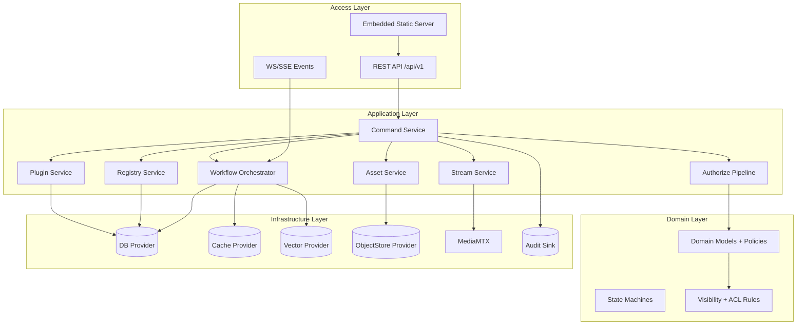
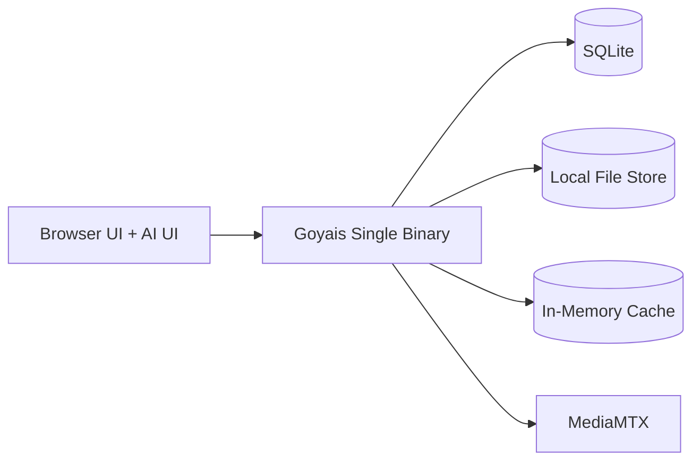
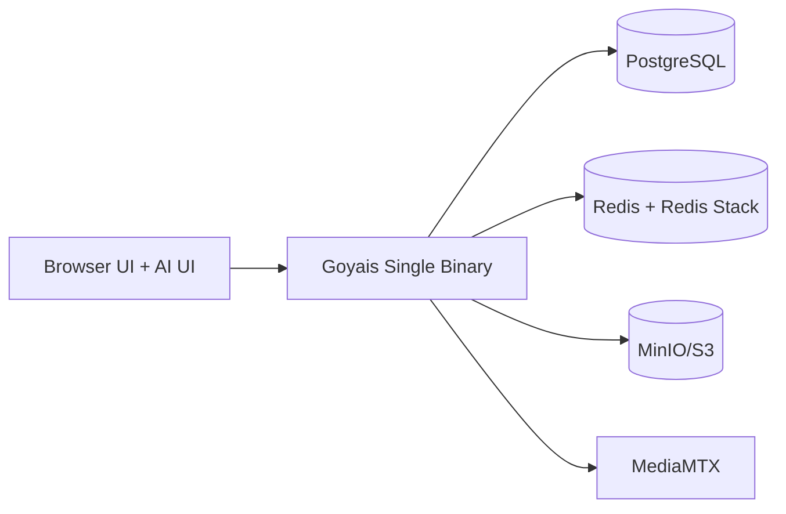

# Goyais v0.1 架构总览

## 1. 目标与边界

v0.1 目标是构建可闭环的多模态 AI 编排平台基础能力，确保：
- AI 与 UI 双入口一致（Command-first）。
- 统一权限与可见性（Agent-as-User + RBAC + ACL + Egress）。
- 最小化运行可落地（SQLite + MediaMTX + 本地文件 + 本地缓存）。
- 生产发布采用单二进制（Go embed 前端 dist）。

v0.1 非目标：多人实时协同、复杂子图复用、计费结算、深度供应链扫描。

## 2. 分层架构

## 3. 模块边界与职责

| 模块 | 职责 | 不负责 |
|---|---|---|
| Command Service | Validate/Authorize/Execute/Audit 主流程；统一副作用入口 | 业务侧复杂计算 |
| AuthZ | RBAC、Visibility、ACL、Egress 多闸门判定 | 实际资源写入 |
| Workflow Orchestrator | 模板实例化、Run/Step 调度、重试与回放 | 身份认证 |
| Registry | Capability/Algorithm/Provider 元数据与版本查询 | 插件安装执行 |
| Plugin Service | 包上传/安装/启停/回滚与依赖校验 | 具体算法执行 |
| Stream Service | MediaMTX path 控制、录制、事件触发 | 业务分析算法 |
| Asset Service | 文件元数据、血缘、可见性与共享 | 画布编辑逻辑 |
| Audit Service | 命令与授权、外发与状态迁移审计 | 业务流程控制 |

## 4. 核心抽象接口（契约）

### 4.1 DBProvider
- 目标：屏蔽 SQLite/PostgreSQL 差异。
- 必需能力：事务、分页查询、乐观并发字段支持、迁移版本记录。

### 4.2 CacheProvider
- 目标：统一 memory/Redis 缓存。
- 必需能力：`get/set/del`、TTL、简单分布式锁（可选）。

### 4.3 VectorProvider
- 目标：统一 Redis Stack 向量检索与 SQLite fallback。
- 必需能力：索引写入、相似度查询、按租户/工作区过滤。

### 4.4 ObjectStoreProvider
- 目标：统一 local/MinIO/S3 文件对象读写。
- 必需能力：put/get/delete、预签名 URL（可选）、元数据标签。
- v0.1 当前实现：
  - `local`：已实现（最小闭环）
  - `minio/s3`：接口与配置占位，业务接口返回 `NOT_IMPLEMENTED`

### 4.5 StreamProvider
- 目标：统一 MediaMTX 控制面交互。
- 必需能力：创建/更新/删除流、鉴权、录制控制、状态采集、事件桥接。

## 5. 运行拓扑

### 5.1 最小化运行拓扑（v0.1 必须闭环）

默认值：
- `db.driver=sqlite`
- `cache.provider=memory`
- `vector.provider=sqlite`
- `object_store.provider=local`
- `stream.provider=mediamtx`

### 5.2 完整模式拓扑（推荐）

## 6. 单二进制发布与静态路由策略（冻结）

### 6.1 发布策略
- 生产环境必须打包为单二进制（Go embed Vite dist）。
- 构建命令：`make build`。
- 开发模式可使用 Vite dev + API proxy，不改变生产策略。

### 6.2 路由优先级（固定）
1. `/api/v1/*` → API 路由。
2. 命中 embed 静态文件路径 → 返回静态文件。
3. 特殊路径策略：
   - `/favicon.ico`：若文件不存在，返回 404。
   - `/robots.txt`：若文件不存在，返回 404。
4. 其余 GET 前端路由（如 `/`、`/canvas`）→ 返回 `index.html`（SPA fallback）。

### 6.3 Header 策略（固定）
- embed 静态文件必须返回正确 `Content-Type`。
- `index.html`（包括 `/` 与 SPA fallback 命中）必须返回：
  - `Cache-Control: no-store`

## 7. API 与执行链路

Command 执行管道（必须）：
1. Validate：schema 与字段约束。
2. Authorize：Tenant/Visibility/ACL/RBAC/Egress。
3. Execute：执行业务动作并触发事件。
4. Audit：记录 `allow/deny`、原因与影响资源。
5. Event：向 UI 推送 run/step 状态。

### 7.1 上下文选择
- 默认使用 JWT claims 中的 `tenantId/workspaceId/userId/roles`。
- 可通过 `X-Workspace-Id`（可选 `X-Tenant-Id`）切换。
- 服务端必须验证 header 目标在 JWT 可访问范围内。
- v0.1 当前阶段（JWT 未接入）：
  - `X-Tenant-Id`、`X-Workspace-Id`、`X-User-Id` 必填；
  - `ownerId = X-User-Id`；
  - 缺失任一 header 返回 `400 MISSING_CONTEXT` + `error.context.missing`。

### 7.2 Thread #3 过渡模式（未接 JWT）
- 在 JWT 尚未接入前，`/api/v1/commands*` 请求必须携带：
  - `X-Tenant-Id`
  - `X-Workspace-Id`
  - `X-User-Id`
- 服务端映射：`ownerId = X-User-Id`。
- 缺任一 header 返回：`400 MISSING_CONTEXT + error.context.missing`，并在 `details.missingHeaders` 返回缺失列表。
- `GET /api/v1/system/healthz` 作为 `GET /api/v1/healthz` 的别名端点，返回结构一致。

### 7.3 当前接口落地状态（2026-02）
- 已落地（可用）：
  - `commands`、`shares`
  - `assets`：`GET /assets`、`GET /assets/{id}`、`POST /assets`（domain sugar -> `asset.upload` command）
- 占位（可达但未实现）：
  - `workflow-*`、`registry-*`、`plugin-market-*`、`streams-*`
  - 统一返回：`501 NOT_IMPLEMENTED` + 领域 `messageKey`

## 8. 配置规范

### 8.1 命名
- ENV：`GOYAIS_*`。
- YAML：`snake_case`。

### 8.2 优先级
- `ENV > YAML > 默认值`。

### 8.3 映射
- `GOYAIS_X_Y_Z` ↔ `x.y.z`（或 `x_y_z`，在加载器实现中固定）。

示例：
- `GOYAIS_DB_DRIVER=sqlite`
- `GOYAIS_OBJECT_STORE_PROVIDER=local`
- `GOYAIS_OBJECT_STORE_LOCAL_ROOT=./data/objects`
- `GOYAIS_STREAM_PROVIDER=mediamtx`

PostgreSQL DSN 规则（冻结）：
- 当 `db.driver=postgres` 时，`GOYAIS_DB_DSN` 必须显式包含 `dbname`。
- 示例（无敏感信息）：`GOYAIS_DB_DSN='dbname=postgres sslmode=disable'`

Asset 本地对象路径（冻结）：
- `object_store.local_root` 默认 `./data/objects`
- 相对路径固定：`tenant/workspace/YYYY/MM/DD/<sha256>`
- 资源 URI 固定：`local://<relative_path>`
- `uri` 与 `hash` 在资产模型中均为必填（NOT NULL），禁止写入空值或 `NULL`

## 9. 前端约束

- 技术栈：Vue + Vite + TypeScript + TailwindCSS。
- UI 必须支持深浅色切换。
- i18n 必须使用 `vue-i18n`，至少包含 `zh-CN/en-US`。
- 后端错误返回 `messageKey`（i18nKey），前端负责映射展示。
