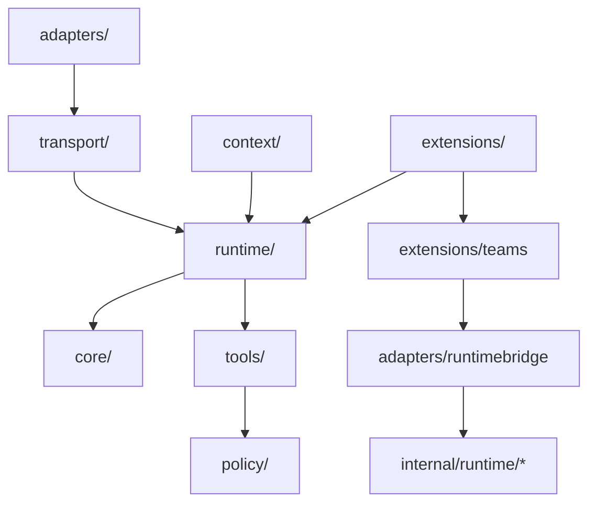

# Agent v4 重构方案（对齐 Claude Code，主文档）

- 日期：2026-03-03
- 范围：`services/hub/internal/agent`（全量重构，含 `internal/runtime` 协同边界）
- 目标：将当前分散在 `internal/agentcore` 与 `internal/httpapi/execution_orchestrator` 的 Agent 能力，统一为 Claude Code 风格的单内核架构，并补齐 Context / Streaming / Extensions / Permissions / Session 生命周期关键能力。
- 说明：本文件已完整吸收 `docs/refactor/ext.md` 的缺口清单，作为唯一执行基准文档。

---

## 实施进展快照（2026-03-04）

1. `internal/agent` 目录骨架已覆盖 core/context/runtime/tools/policy/extensions/transport/adapters，并具备对应测试。
2. `runtime/loop.Engine` 已作为真实执行实现（FIFO、生命周期事件、控制动作、订阅回放、compaction 联动）。
3. CLI/ACP 已统一接入 v4 Engine；HTTP 运行时默认模式已切换为 `hybrid`，且 v4 submit 成功后优先走 v4 主链。
4. 仍处于 E→F 收敛期：legacy fallback、旧枚举（`ExecutionState/ExecutionEventType`）与 `ExecutionOrchestrator` 主职责尚未清理完成。
5. 本文仍为架构主基线；阶段进度与门禁证据以 `docs/refactor/refactor-taks-plan-table.md` 最新快照为准。

---

## 1. 目标与边界

### 1.1 重构目标

1. Agent 设计全面参考 Claude Code。
2. 新版统一运行时必须覆盖 CLI、ACP、HTTP 三条路径。
3. 新版完成后删除旧版 `internal/agentcore` 代码与引用。
4. 提供可执行迁移方案，防止 AI 在实现过程中架构漂移。

### 1.2 不变式

1. Hub 保持执行 authority。
2. 单会话单活跃执行 + FIFO。
3. Workspace 隔离与授权边界不变。
4. Hub API / OpenAPI / TS 合约联动更新。

### 1.3 契约策略

1. 本轮允许破坏性调整，但必须提供适配层与迁移清单。
2. 旧接口仅在迁移窗口保留，禁止长期双轨。
3. 任何跨层行为变更必须附带回归证据（事件流、契约、状态机）。

---

## 2. As-Is 关键问题与补全点总览

### 2.1 Engine 接口与真实执行路径分裂（核心缺陷）

现状：
1. `agentcore/runtime/engine.go` 定义了 `Engine` 接口。
2. 唯一实现 `LocalEngine` 仅是内存测试桩。
3. 真正模型调用、tool loop、审批流程在 `httpapi/execution_orchestrator.go`。

影响：
1. CLI/ACP 路径无法共享真正执行能力。
2. 系统同时维护两套执行语义，回归成本高。

v4 决策：
1. `internal/agent/runtime/loop` 必须成为 `Engine` 的真正实现。
2. CLI/ACP/HTTP 统一走同一套 Engine + Event Stream。

### 2.2 两套 runtime 并存导致职责冲突

现有还有 `services/hub/internal/runtime/*`（CQRS、domain event、sqlite store、scheduler、agentgraph）。

v4 决策：
1. 保留 `internal/runtime` 作为“持久化/投影/调度基础设施层”。
2. `internal/agent/runtime` 只负责“执行控制与对话运行时”。
3. `internal/agent/adapters/runtimebridge` 负责桥接。
4. `internal/runtime/agentgraph` 演进并吸收到 `internal/agent/extensions/teams`。

### 2.3 ext 缺口映射（完整并入）

| ext 编号 | 缺口主题 | 本文落位 |
|---|---|---|
| #1 | Engine/执行路径分裂 | §2.1, §3, §12 |
| #2 | Context Window/Compaction | §5 |
| #3 | Streaming 背压与生命周期 | §6 |
| #4 | Event Payload 强类型 | §4.2 |
| #5 | Hooks 事件模型不完整 | §7.1 |
| #6 | Skills 细节缺失 | §7.2 |
| #7 | Plugins 框架粗略 | §7.3 |
| #8 | Subagents 约束缺失 | §7.4 |
| #9 | internal/runtime 处理策略 | §2.2, §12.1 |
| #10 | 双状态/事件词汇合并 | §4.1, §12.2 |
| #11 | 测试策略具体化 | §13 |
| #12 | Permission 行为矩阵 | §8.1 |
| #13 | Slash 假 Run 处理 | §9.1 |
| #14 | StdoutGuard 根因修复 | §9.2 |
| #15 | 渐进式回归验证 | §13.2 |
| #16 | 模块依赖图 | §10.1 |
| #17 | 接口清单 | §10.2 |
| #18 | Hooks 17 事件 + 4 handler + 事件化返回协议 | §7.1 |
| #19 | 文件级 Checkpoint | §9.3 |
| #20 | 上下文加载顺序 | §5.2 |
| #21 | Settings 数组合并语义 | §5.3 |
| #22 | 权限规则语法粒度 | §8.2 |
| #23 | Agent Teams 协作系统 | §7.5 |
| #24 | 双层沙箱与网络沙箱 | §8.3 |
| #25 | 会话管理操作 | §11 |

---

## 3. To-Be 架构（统一版）

```text
internal/agent
  core/                  # 状态机、事件类型、错误语义、payload强类型
  runtime/               # Engine实现、loop、model、compaction、session-lifecycle
  tools/                 # registry/executor/spec/checkpoint
  policy/                # permission mode matrix / rule DSL / sandbox
  context/               # settings / instructions / memory / prompt-assemble
  extensions/
    hooks/               # 17事件 + 4handler + matcher + per-event schema + dedupe
    mcp/
    outputstyles/
    skills/
    slash/
    subagents/
    teams/
    plugins/
  transport/             # acp/stdio/sse/ws/json-stream + subscriber-manager
  adapters/              # httpapi/cli/acp/runtimebridge
```

关键架构决策：
1. Engine 统一：CLI/ACP/HTTP 全部通过 `runtime.Engine`。
2. Event 统一：核心事件在 `core/events` 定义一次，适配层仅做编码，不做语义翻译。
3. Compaction 内建：长对话上下文压缩属于运行时核心能力，不是插件能力。
4. Streaming 专项：transport 层必须有背压、生命周期管理、显式退订。
5. Session 生命周期一等公民：resume/fork/rewind/clear 为内核能力，不由前端拼装。

---

## 4. 核心模型统一设计

### 4.1 RunState 与事件枚举统一

v4 统一后：
1. 不再保留并行的 `ExecutionState/ExecutionEventType` 与 `RunState/RunEventType`。
2. 仅保留一套核心状态与事件命名（以 `Run*` 语义为主）。

迁移要求：
1. 输出“旧 -> 新”状态映射表。
2. 若持久层存旧字段，提供 SQL 迁移脚本与回滚脚本。
3. 迁移结束后代码中不再出现旧枚举定义。
4. 适配层仅在过渡期保留 alias，不新增新逻辑。

### 4.2 Event Payload 强类型化

`Payload map[string]any` 仅作为 transport 编码形态，不作为业务读取入口。

业务层必须使用强类型 payload struct（示意）：
1. `OutputDeltaPayload { Delta string; ToolUseID string }`
2. `ApprovalNeededPayload { ToolName string; Input map[string]any; RiskLevel string }`
3. `RunFailedPayload { Code string; Message string; Metadata map[string]any }`

要求：
1. 每个 `RunEventType` 对应一个 payload struct。
2. 禁止在核心流程中通过 `"delta"/"content"` 字符串探测字段。
3. 编译期保证 payload 与 event type 关联正确（泛型或注册表）。

---

## 5. Context 与 Prompt 组装（补全）

### 5.1 Context Window / Compaction

新增 `runtime/compaction`，能力包括：
1. 自动触发：按 token 使用率阈值触发压缩。
2. 压缩策略：近期消息保留 + 历史消息摘要 + 可丢弃段裁剪。
3. 摘要注入：压缩结果以系统上下文片段注入后续轮次。
4. 手动触发：支持 `/compact` 命令显式压缩。
5. cursor 一致性：压缩后保留可追踪 cursor 映射，`Subscribe` 不失序。
6. Hook 联动：压缩前触发 `PreCompact` 事件。

### 5.2 上下文加载顺序（严格定义）

加载行为按“启动全量 + 访问按需”两阶段执行：
1. 启动时全量加载：managed 指令文件、用户主指令文件、用户规则、项目祖先目录指令文件（向上遍历到仓库根）。每个目录按 `AGENTS.override.md > AGENTS.md > CLAUDE.md` 仅选 1 个文件生效。
2. 按需加载：读取子目录文件时，对该目录按同优先级链重新解析并注入指令文件（每目录仍仅生效 1 个）。

系统提示组装顺序固定为：
1. 管理策略指令文件（`AGENTS.override.md > AGENTS.md > CLAUDE.md`）
2. 用户主指令文件（`~/.claude/AGENTS.override.md > ~/.claude/AGENTS.md > ~/.claude/CLAUDE.md`）
3. 用户规则 `~/.claude/rules/*.md`
4. 项目祖先目录指令文件（启动时，每目录按 `AGENTS.override.md > AGENTS.md > CLAUDE.md` 选 1）
5. 项目规则 `.claude/rules/*.md`（支持路径作用域）
6. 本地指令文件（`AGENTS.local.md > CLAUDE.local.md`，gitignored）
7. 自动记忆 `memory/MEMORY.md`（仅首 200 行）
8. Skills 描述（预算控制）
9. MCP 工具定义
10. 导入内容（`@path`，最大递归深度 5 hops）

附加约束：
1. `instructionDocExcludes` 支持以 glob 跳过指定指令文件（覆盖 `AGENTS.override.md`、`AGENTS.md`、`CLAUDE.md`）。
2. `/compact` 后必须从磁盘重新读取已注入的指令文件（AGENTS/CLAUDE 体系）与规则文件再注入（会话内旧注入不保留）。
3. 规则 frontmatter `paths` 命中才加载；同层冲突按文件顺序稳定合并。

### 5.3 Settings 合并语义（严格定义）

优先级（高 -> 低）：`managed > cli > local > project > user`。

合并规则：
1. 标量：高优先级覆盖低优先级。
2. 数组（如 `permissions.allow/deny`、sandbox paths）：跨层拼接 + 去重，不替换。
3. map：按 key 深度合并，冲突 key 走优先级覆盖。
4. 生成最终配置时输出来源追踪（用于审计与 debug）。

### 5.4 多目录支持（additionalDirectories）

必须支持三种入口：
1. CLI：`--add-dir <path>`（可多次传入）。
2. 交互命令：`/add-dir <path>`。
3. 配置项：`additionalDirectories`。

实现要求：
1. 多目录仅扩展可访问工作区，不改变会话主工作目录。
2. 权限规则、路径作用域、sandbox 与审计日志都要带目录来源。
3. Workspace 边界校验仍由 Hub 统一裁决，不允许跨租户目录逃逸。

---

## 6. Streaming 与订阅生命周期（补全）

新增 `transport/subscribers` 统一管理订阅。

必须具备：
1. 有界缓冲策略（可配置）：阻塞生产者 / 丢弃旧消息 / 丢弃新消息 / overflow 错误通知。
2. 显式生命周期：`Subscribe`、`Unsubscribe`、客户端断连清理、超时回收。
3. 中断语义：客户端中断时运行时可选择继续或取消；必须清理 goroutine/channel。
4. 桥接协议：SSE 与 WebSocket 共享同一 subscriber manager，不复制状态机。
5. 背压可观测：输出 lag、drop-count、subscriber-count 指标。

### 6.1 SDK / Headless（`claude -p`）兼容层

统一到 transport 的无头执行能力，要求：
1. 支持 `claude -p` 非交互执行（CI/脚本场景）。
2. `--output-format` 至少支持 `text/json/stream-json`。
3. `stream-json` 逐行事件格式统一为 `{type: "text"|"tool_use"|"tool_result"|"result", ...}`。
4. 支持 `--system-prompt`（覆盖）与 `--append-system-prompt`（追加）。
5. 支持 `--allowedTools` / `--disallowedTools` CLI 级名单。
6. 支持 `--dangerously-skip-permissions` CLI 级绕过开关。
7. 提供 GitHub Actions 集成基线：`anthropics/claude-code-action@v1`。

---

## 7. 扩展模块设计（完整补全）

### 7.1 Hooks（17 事件 + 4 handler + 事件专属输出协议）

事件模型（17 个）：
1. `SessionStart`
2. `SessionEnd`
3. `UserPromptSubmit`
4. `PreToolUse`
5. `PermissionRequest`
6. `PostToolUse`
7. `PostToolUseFailure`
8. `Notification`
9. `SubagentStart`
10. `SubagentStop`
11. `Stop`
12. `TeammateIdle`
13. `TaskCompleted`
14. `ConfigChange`
15. `WorktreeCreate`
16. `WorktreeRemove`
17. `PreCompact`

说明：`SessionResume` 不是独立事件，而是 `SessionStart` 的 matcher 值。

Handler 类型：
1. `command`（shell）
2. `http`（POST）
3. `prompt`（单轮模型评估）
4. `agent`（多轮子代理）

Matcher 与输入域：
1. 支持精确匹配 / 通配符 / 正则。
2. `SessionStart`：`startup|resume|clear|compact`。
3. `Notification`：`permission_prompt|idle_prompt|auth_success|elicitation_dialog`。
4. `ConfigChange`：`user_settings|project_settings|local_settings|policy_settings|skills`。
5. `SessionEnd`：`clear|logout|prompt_input_exit|bypass_permissions_disabled|other`。
6. `PreCompact`：`manual|auto`。

异步语义与去重：
1. 以 hook 对象 `background: true` 标记异步执行。
2. 异步 hook 不能影响 permission/stop 决策。
3. matcher 命中后对重复 `command` 自动 dedupe，防止重复触发。
4. `Stop` 事件必须检查 `stop_hook_active`，防止无限循环重入。

返回协议按事件定义（不使用统一 `approve|deny|continue`）：
1. `PreToolUse`：`permissionDecision`（`allow|deny|ask`）。
2. `Stop` / `PostToolUse`：`decision`（`block`）。
3. `UserPromptSubmit`：`additionalContext`（string）。
4. `SessionStart`：`stdout`（注入上下文）。

`command` 退出码语义：
1. `0`：继续，stdout 可入上下文。
2. `2`：阻断，stderr 反馈给模型/用户。
3. 其他：继续，stderr 仅记录日志。

### 7.2 Skills（格式、预算、上下文 fork）

必须支持：
1. `SKILL.md`：YAML frontmatter + Markdown body。
2. frontmatter 关键字段：`name/description/argument-hint/disable-model-invocation/user-invocable/allowed-tools/model/context/agent/hooks`。
3. 参数替换：`$ARGUMENTS`、`$ARGUMENTS[N]`、`$N`、`${CLAUDE_SESSION_ID}`。
4. 动态上下文注入：`!` 命令预处理。
5. 发现层级冲突优先级：`enterprise > personal > project`。
6. 上下文预算：默认约 `2%` context window，fallback `16000 chars`，可由 `SLASH_COMMAND_TOOL_CHAR_BUDGET` 覆盖。
7. `context: fork`：在子代理隔离上下文中运行。
8. 调用控制矩阵：用户可调、模型可调、禁模型调用。
9. 插件技能命名空间：`plugin-name:skill-name`。
10. 遵循 Agent Skills 开放标准：<https://agentskills.io>。
11. `SKILL.md` 推荐长度不超过 500 行。

### 7.3 Plugins（完整 schema + CLI 管理 + 安全约束）

插件目录基线：

```text
my-plugin/
├── .claude-plugin/
│   └── plugin.json
├── skills/
├── agents/
├── hooks/hooks.json
├── .mcp.json
├── .lsp.json
├── settings.json
└── scripts/
```

必须支持：
1. `plugin.json` 完整 schema：`name/version/description/author/commands/agents/skills/hooks/mcpServers/outputStyles/lspServers`。
2. 生命周期：discover -> validate -> load -> register -> activate/deactivate。
3. namespace 隔离：插件卸载时整体回收 skills/hooks/mcp。
4. 来源与管理：支持 `user/project/local/managed` 四安装作用域。
5. CLI：`claude plugin install/uninstall/enable/disable/update`。
6. 开发模式：`--plugin-dir` 免安装调试。
7. 环境变量：`${CLAUDE_PLUGIN_ROOT}` 可用于路径引用。
8. 插件缓存：`~/.claude/plugins/cache`。
9. 路径安全：插件配置路径必须相对且不可逃逸插件根目录。
10. 支持 LSP 服务器集成（`.lsp.json` + `lspServers`）。
11. `--debug` 输出插件发现/加载/注册详细日志。
12. 错误隔离：单插件失败不影响核心和其他插件。

### 7.4 Subagents（定义、隔离、并发）

必须支持：
1. 定义格式：`.claude/agents/*.md` + frontmatter。
2. 内建类型清单：`Explore(Haiku,只读)`、`Plan(继承,只读)`、`general-purpose(继承,全工具)`、`Bash(继承,仅Bash)`、`statusline-setup(Sonnet)`、`Claude Code Guide(Haiku)`。
3. frontmatter 补全：`allowedTools`、`disallowedTools`、`permissionMode`、`maxTurns`、`memory`、`background`。
4. 持久记忆：`user/project/local` 三级，`MEMORY.md` 仅首 200 行注入。
5. `background: true` 支持后台执行；后台下 `AskUserQuestion` 静默失败。
6. CLI 临时定义：`--agents <json>`（会话级）。
7. 自动压缩：上下文约 95% 容量时自动 compact（`CLAUDE_AUTOCOMPACT_PCT_OVERRIDE` 可覆盖）。
8. 转录落盘：`~/.claude/projects/{project}/{sessionId}/subagents/agent-{agentId}.jsonl`。
9. 清理策略：`cleanupPeriodDays` 默认 30 天。
10. 禁止嵌套：子代理深度固定为 1。
11. 前台任务可通过 `Ctrl+B` 转后台。
12. 并发调度与结果归并：多子代理并行，返回单条结构化总结给父代理。

### 7.5 Agent Teams（共享任务与协作协议）

必须支持：
1. 实验特性开关：`CLAUDE_CODE_EXPERIMENTAL_AGENT_TEAMS=1`。
2. 展示模式：`in-process`（默认）/`tmux`/`auto`，CLI `--teammate-mode`。
3. 存储路径：`~/.claude/teams/{name}/config.json` 与 `~/.claude/tasks/{name}/`。
4. 共享任务列表：`pending/in-progress/completed` + 依赖链 + 文件锁。
5. 直接消息邮箱：成员间可直接消息通信。
6. 计划审批流：队友 plan mode -> 提交 -> lead 审批/拒绝+反馈 -> 修订重提。
7. 已知限制：in-process 无 session resumption；一 lead 一 team；不可嵌套；lead 固定。
8. 分屏限制：VS Code Terminal、Windows Terminal、Ghostty 不支持分屏。
9. 质量门禁 Hook：`TeammateIdle` / `TaskCompleted` 可阻止完成并反馈。

### 7.6 Output Styles（新增）

必须支持：
1. 内建风格：`default` / `explanatory` / `learning`。
2. 自定义风格目录：`~/.claude/output-styles/` 与 `.claude/output-styles/`。
3. frontmatter 字段：`name` / `description` / `keep-coding-instructions`。
4. 激活方式：`/output-style` 命令或 `outputStyle` 设置字段。
5. 注入语义：Output Style 替换系统提示的指定片段；与项目指令文档（`AGENTS.override.md`/`AGENTS.md`/`CLAUDE.md`）的追加行为分离。

### 7.7 MCP（完整设计，新增）

必须支持：
1. Tool Search：MCP 工具描述总量超过上下文约 10% 时自动启用（`ENABLE_TOOL_SEARCH`）。
2. 认证：远程 MCP 支持 OAuth 2.0（`--client-id` / `--client-secret` / `--callback-port`）。
3. Prompts as Commands：`/mcp__<server>__<prompt>`。
4. Resource References：`@server:protocol://resource/path`。
5. 输出上限：警告 `10000 tokens`，硬上限 `25000`，可由 `MAX_MCP_OUTPUT_TOKENS` 覆盖。
6. `.mcp.json` schema：`type/url/headers/command/args/env`，支持 `${VAR:-default}` 展开。
7. 传输类型：`HTTP(Streamable)`、`SSE(Deprecated)`、`stdio(local)`。
8. 安装/发现作用域：`local(默认) > project > user`，并兼容 managed。
9. Claude Code as MCP Server：支持 `claude mcp serve` 暴露内建工具。
10. Managed MCP：支持 `managed-mcp.json` + `allowedMcpServers/deniedMcpServers` 策略。

---

## 8. 权限、规则 DSL 与沙箱（完整补全）

### 8.1 Permission Mode 矩阵（精确定义）

| Mode | 读操作 | 写操作 | Bash | MCP 工具 |
|---|---|---|---|---|
| default | 自动 | 需审批 | 需审批 | 需审批 |
| acceptEdits | 自动 | 自动 | 需审批 | 需审批 |
| plan | 自动 | 禁止 | 禁止 | 禁止（只读可选） |
| dontAsk | 自动 | 仅预批准规则可自动，否则拒绝 | 仅预批准规则可自动，否则拒绝 | 仅预批准规则可自动，否则拒绝 |
| bypassPermissions | 自动 | 自动 | 自动（可无沙箱） | 自动 |

补充：
1. `dontAsk` 语义是“自动拒绝未预批准操作”，不是“自动允许全部”。
2. 规则层为三层：`deny -> ask -> allow`（第一条匹配生效；`deny` 永远优先）。
3. 必须支持 `permissions.ask` 独立数组，不能退化为仅 `allow/deny`。
4. 支持 per-tool 与参数级规则（如 `Bash(git *)`）。

### 8.2 权限规则 DSL（语法粒度）

规则示例：
1. `Bash(npm run *)`
2. `Read(./.env)`
3. `Edit(/src/**/*.ts)`
4. `Read(//Users/alice/secrets/**)`
5. `Read(~/Documents/*.pdf)`
6. `WebFetch(domain:example.com)`
7. `mcp__puppeteer__*`
8. `Agent(Explore)`
9. `Skill(deploy *)`

实现约束：
1. 采用统一 parser（不能依赖字符串 contains）。
2. 规则评估顺序固定：`deny` > `ask` > `allow`，并输出命中解释链。
3. Bash 通配符必须保留词边界语义：`Bash(npm run *)` 的 `*` 在空格后按词边界匹配；`Bash(ls*)` 无词边界限制。
4. 路径规则遵循 gitignore 语义并支持四种前缀：`//path`（绝对文件系统）、`~/path`（用户目录）、`/path`（项目根相对）、`path` 或 `./path`（当前目录相对）。
5. `/Users/alice/file` 不是绝对路径规则；绝对路径必须写 `//Users/alice/file`。
6. Shell 操作符感知：`Bash(safe-cmd *)` 不匹配 `safe-cmd && rm -rf /`。

### 8.3 双层沙箱与网络沙箱

双层模型：
1. Permissions 层：覆盖所有工具的软件级权限控制。
2. Sandbox 层：覆盖 Bash 及其子进程的 OS 级约束（macOS/Linux）。

网络沙箱：
1. 通过沙箱外代理统一控制网络访问。
2. 支持域名 allowlist（`sandbox.network.allowedDomains`）。
3. 未知域名触发权限审批。
4. 子进程（如 `kubectl/terraform/npm`）继承网络限制。

### 8.4 企业管理策略（Managed-only，新增）

必须支持以下 managed-only 设置：
1. `disableBypassPermissionsMode`：禁止 bypass 模式。
2. `allowManagedPermissionRulesOnly`：仅允许 managed 权限规则。
3. `allowManagedHooksOnly`：仅运行 managed hooks。
4. `allowManagedMcpServersOnly`：仅使用 managed MCP 服务器。
5. `blockedMarketplaces`：阻断插件市场来源。
6. `sandbox.network.allowManagedDomainsOnly`：仅允许 managed 域名白名单。
7. `allow_remote_sessions`：控制远程会话访问。

---

## 9. Slash、StdoutGuard 与 Checkpoint 专项决策

### 9.1 Slash 输出不再伪装假 Run

当前 hack：`buildSlashEvents()` 伪造 `run_queued -> run_completed`。

v4 决策：采用双通道。
1. `RunEvent`：仅用于真正 Engine 执行。
2. `CommandResponseEvent`：用于 slash 命令即时返回。
3. 适配层可在过渡期提供兼容封装，核心禁止 fake run。

### 9.2 StdoutGuard 根因修复

v4 决策：
1. transport 层注入 writer 接口，协议输出只走 transport writer。
2. agent 内核禁止直接写 `os.Stdout`。
3. 业务日志走 logger/stderr，不污染 JSON-RPC stream。

### 9.3 文件级 Checkpoint / Rewind

新增 `tools/checkpoint`：
1. 编辑工具执行前自动创建文件快照（独立于 git）。
2. 支持按编辑步骤回退。
3. 与会话 `rewind` 操作联动。
4. 多步回退需保持文件与对话状态一致。

---

## 10. 模块依赖图与接口清单（补全）

### 10.1 模块依赖图



### 10.2 Interface Inventory（合同基线）

```go
type Engine interface {
    StartSession(ctx context.Context, req StartSessionRequest) (SessionHandle, error)
    Submit(ctx context.Context, sessionID string, input UserInput) (runID string, err error)
    Control(ctx context.Context, runID string, action ControlAction) error
    Subscribe(ctx context.Context, sessionID string, cursor string) (EventSubscription, error)
}

type CommandBus interface {
    Execute(ctx context.Context, sessionID string, cmd SlashCommand) (CommandResponse, error)
}

type ToolExecutor interface {
    Execute(ctx context.Context, call ToolCall) (ToolResult, error)
}

type HookDispatcher interface {
    Dispatch(ctx context.Context, event HookEvent) (HookDecision, error)
}

type SkillLoader interface {
    Discover(ctx context.Context, scope SkillScope) ([]SkillMeta, error)
    Resolve(ctx context.Context, ref SkillRef) (SkillDefinition, error)
}

type SubagentRunner interface {
    Run(ctx context.Context, req SubagentRequest) (SubagentResult, error)
}

type TeamCoordinator interface {
    Assign(ctx context.Context, task TeamTask) error
    Inbox(ctx context.Context, agentID string) ([]TeamMessage, error)
}

type ContextBuilder interface {
    Build(ctx context.Context, req BuildContextRequest) (PromptContext, error)
}

type PermissionGate interface {
    Evaluate(ctx context.Context, req PermissionRequest) (PermissionDecision, error)
}

type CheckpointStore interface {
    Snapshot(ctx context.Context, req SnapshotRequest) (CheckpointID, error)
    Restore(ctx context.Context, id CheckpointID) error
}
```

---

## 11. 会话管理操作（补全）

必须支持：
1. `Resume`：`--continue/--resume`，沿用同一 session ID 追加消息。
2. `Fork`：`--continue --fork-session`，新 session ID 继承历史。
3. `Rewind`：回退到指定 checkpoint（代码与对话同步）。
4. `Clear`：清空历史并重置上下文链。
5. `Desktop Handoff`：`/desktop` 将当前会话移交到桌面端。
6. `Mobile Handoff`：`/teleport` 将当前会话移交到移动端。

约束：
1. 会话级临时权限在 `resume/fork` 不自动恢复。
2. fork 后事件流 cursor 独立。
3. rewind 必须触发一致性校验（文件快照、运行状态、事件游标）。
4. 跨表面移交必须保留 session identity、权限模式与未完成任务上下文。

---

## 12. 迁移策略（更新）

### 12.1 前置梳理（A0）

1. 完成 `internal/runtime` 与 `internal/agent/runtime` 关系决策。
2. 输出模块归属表（保留/合并/废弃）。
3. 明确 `agentgraph -> extensions/teams` 演进边界。

### 12.2 双轨迁移（A1~D）

1. A1：建立 `internal/agent` 新内核 + `runtime.Engine` 真实现。
2. A2：统一 `RunState/RunEventType` 与强类型 payload。
3. B：接入 context loading、settings merge、compaction。
4. C：接入 transport subscriber manager、slash 双通道、checkpoint。
5. D：接入 hooks/skills/plugins/subagents/teams。

### 12.3 收口（E）

1. 删除 `internal/agentcore` 与旧映射逻辑。
2. 移除 fake run/slash hack 与 stdout hack。
3. 同步 OpenAPI + TS 合约。
4. 清理旧枚举与临时兼容层。

---

## 13. 测试与回归策略（完整补全）

### 13.1 旧测试迁移分层

1. 直接迁移类：仅改 import path 与构造入口。
2. 重写类：接口语义变化导致测试需重写。
3. 新增类：覆盖 compaction、subscriber 生命周期、hooks handler 类型、permission DSL、session lifecycle。

### 13.2 渐进式回归验证（强制）

1. Event replay 对照：固定输入对比旧/新事件序列。
2. Shadow mode：旧系统与 v4 并行执行同 prompt，对比差异报告。
3. 契约测试：SSE/WebSocket 事件定义为 JSON Schema，生产端与消费端双向校验。

### 13.3 专项测试清单

1. Permission mode 矩阵测试（mode x tool-risk）。
2. Permission DSL 语法与 shell 操作符绕过测试。
3. Subscriber 泄漏测试（goroutine/channel baseline）。
4. Cursor 在 compaction 前后一致性测试。
5. Checkpoint/Rewind 多步回退一致性测试。
6. Session resume/fork/clear 行为测试。
7. Team 协作协议测试（任务锁、消息、审批流）。

---

## 14. 风险与缓解

1. 高风险：Engine 统一过程行为漂移。
   缓解：先统一状态和事件，再切入口，按阶段 replay。
2. 高风险：compaction 对历史语义影响。
   缓解：摘要前后问答一致性回归集 + PreCompact hook。
3. 高风险：hooks/plugins/agent 可执行面扩大。
   缓解：默认最小权限 + allowlist + 审计日志。
4. 中风险：streaming 高并发泄漏。
   缓解：订阅生命周期压测 + 指标告警。
5. 中风险：network sandbox 误拦截影响工具可用性。
   缓解：灰度域名策略 + 审批回退机制。

---

## 15. 执行落地检查表（Definition of Done）

1. 代码中无 `ExecutionState/ExecutionEventType` 残留。
2. `internal/agentcore` 引用为 0。
3. hooks 17 事件、4 handler 类型、事件专属返回 schema 均有测试与文档。
4. settings 合并语义与权限 DSL 已通过契约测试。
5. slash 不再产生 fake run，stdout 不再污染协议流。
6. checkpoint/rewind/resume/fork/clear 可端到端运行。
7. OpenAPI、TS 合约、Hub 行为一致。

---

## 16. 参考资料

- Claude Code Overview: <https://code.claude.com/docs/en/overview>
- Settings: <https://code.claude.com/docs/en/configuration/settings>
- Permissions: <https://code.claude.com/docs/en/configuration/permissions>
- Sandboxing: <https://code.claude.com/docs/en/configuration/sandboxing>
- CLI Reference: <https://code.claude.com/docs/en/reference/cli-reference>
- Interactive Mode: <https://code.claude.com/docs/en/reference/interactive-mode>
- Memory: <https://code.claude.com/docs/en/reference/memory>
- Slash Commands: <https://code.claude.com/docs/en/reference/slash-commands>
- Skills: <https://code.claude.com/docs/en/build-with-claude-code/skills>
- Hooks: <https://code.claude.com/docs/en/build-with-claude-code/hooks>
- MCP: <https://code.claude.com/docs/en/build-with-claude-code/mcp>
- Sub-agents: <https://code.claude.com/docs/en/build-with-claude-code/sub-agents>
- Agent Teams: <https://code.claude.com/docs/en/build-with-claude-code/agent-teams>
- Plugins Overview: <https://code.claude.com/docs/en/build-with-claude-code/plugins>
- Plugins Reference: <https://code.claude.com/docs/en/build-with-claude-code/plugins-reference>
- Output Styles: <https://code.claude.com/docs/en/build-with-claude-code/output-styles>
- SDK Reference: <https://code.claude.com/docs/en/reference/sdk>
- Claude Code GitHub: <https://github.com/anthropics/claude-code>
