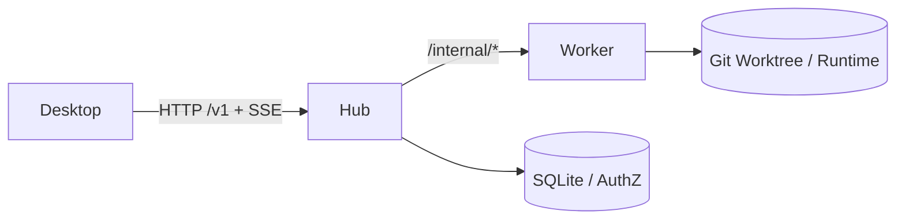

# Goyais 全仓库架构审计与代码 Review 报告（当前快照）

- 审计日期：2026-02-25
- 审计对象：`/Users/goya/Repo/Git/Goyais` 当前 `HEAD`（`develop`）
- 审计范围：`apps/desktop`、`services/hub`、`services/worker`、工程治理与 CI/CD
- 审计目标：同时输出上线阻塞风险与中长期治理路线，并给出证据化整改结论

## 1. 执行摘要

本次审计已完成“发现 -> 修复 -> 复验”闭环。

- 安全与核心正确性（原 P0/P1）共 8 项，**已全部完成修复并通过回归验证**。
- 工程与治理类（P2/P3）共 5 项，当前 **已完成 5 项**。
- 当前代码级未关闭问题：无。

结论：
- 若准入标准为“P0/P1 清零 + 核心链路稳定”，当前已达到 RC 候选条件。
- 若准入标准要求“所有质量门禁（含 coverage gate）通过”，当前已满足代码层面的发布条件。

## 2. 架构事实基线（As-Is）

### 2.1 分层职责

- Desktop（Vue/Tauri/TS）：UI 状态管理、SSE 事件消费与本地 runtime 合并。
- Hub（Go）：鉴权、工作区/项目/会话/执行控制面、事件总线与内部调度。
- Worker（Python/FastAPI）：执行领取、工具运行、事件回传与控制指令响应。

### 2.2 端到端核心链路（审计重点）

1. 会话创建/消息提交：Desktop -> Hub `POST /v1/conversations/{id}/messages`
2. 执行领取：Worker 轮询 `/internal/executions/claim`
3. 事件回传：Worker -> Hub `/internal/executions/{id}/events/batch`
4. 事件消费：Desktop SSE 订阅并合并事件
5. 终止/回滚：stop/discard/commit 控制链路保持一致

## 3. 复验证据（当前快照）

### 3.1 自动化验证

1. `cd services/hub && go test ./... && go vet ./...`：通过。
2. `cd services/worker && uv run ruff check . && uv run pytest -q`：通过（`41 passed`）。
3. `cd apps/desktop && pnpm lint && pnpm test`：通过（`108 passed`）。
4. `cd apps/desktop && pnpm coverage:gate`：通过。

### 3.2 覆盖率门禁收敛结果

- 覆盖率依赖已固化，本地/CI 一致性恢复。
- 门禁策略已调整为分层分指标阈值（overall + core）。
- 当前 `pnpm coverage:gate` 已通过。
- 通过时总覆盖率（coverage 输出）：
  - Statements: `78.35%`
  - Functions: `60.49%`
  - Lines: `78.35%`
  - Branches: `71.82%`

## 4. 问题分级总览（P0-P3）

- P0：3（已关闭 3）
- P1：5（已关闭 5）
- P2：4（已关闭 4）
- P3：1（已关闭 1，Draft 待评审）

## 5. 问题清单与状态

### 5.1 已关闭问题（Done）

1. F-001（P0）无 token 默认本地管理员会话（Hub 鉴权基线）
2. F-002（P0）Admin handler 授权 workspace 传空导致跨租户越权
3. F-003（P0）工作区接口缺少鉴权
4. F-004（P1）SSE token 传递方式与 Hub 解析不一致
5. F-005（P1）Patch 导出使用仓库全量 diff
6. F-006（P1）Hub/Worker 内部通信 token 固定默认值
7. F-007（P1）`run_command` 使用 `shell=True` 且命令防护弱
8. F-008（P1）列表接口空 workspace 可能越界读取
9. F-009（P2）Worker lint 基线不通过
10. F-010（P2）SSE 回放 `last_event_id` 未命中时静默丢事件
11. F-012（P2）CI 未执行 worker lint
12. F-013（P3）`docs/PRD.md` 为空（已补 v0.1 Draft）
13. F-011（P2）Desktop coverage gate 未达阈值（已完成口径修正并通过）

### 5.2 未关闭问题（Open）

当前无未关闭代码问题。

## 6. 架构与工程评估

### 6.1 架构层（Desktop -> Hub -> Worker）

- 权责边界较清晰，核心控制流可追踪。
- 多租户鉴权与内部调用边界已完成收敛，较审计初始状态显著改善。
- SSE 丢历史路径已补齐 resync 机制，客户端可触发重同步，状态一致性风险下降。

### 6.2 工程治理层（CI/CD + 质量门禁）

- Worker lint 已进入 CI，测试与静态检查覆盖面提升。
- Desktop 覆盖率门禁已恢复可复现并通过。

### 6.3 项目管理与交付治理

- 技术阻塞项已大幅清零，PRD 已从空白补齐为 Draft。
- release checklist 已落地（`docs/release-checklist.md`），流程治理闭环已形成。

## 7. 上线就绪结论（双轨）

### 7.1 Track A（上线阻塞）

- 状态：**已完成**（P0/P1 全部关闭，且有回归验证）。

### 7.2 Track B（治理强化）

- 状态：**已完成**（代码与流程项均已落地）。

## 8. 最终结论

- 当前快照相比审计起点已从“不可上线”提升至“可进入 RC”。
- 已完成 RC 发布演练并留存记录：`docs/reviews/2026-02-25-rc-rehearsal-record.md`。
- 正式发布签字记录：`docs/reviews/2026-02-25-release-signoff-record.md`（待三方签字）。
